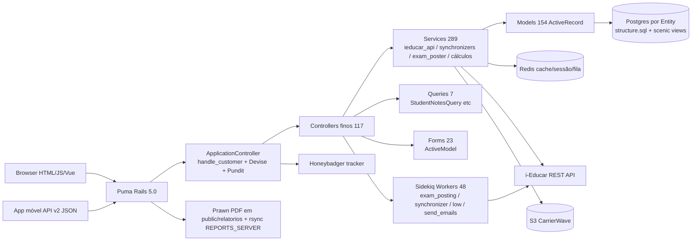
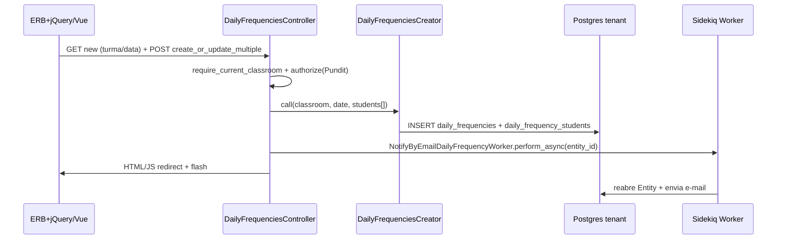
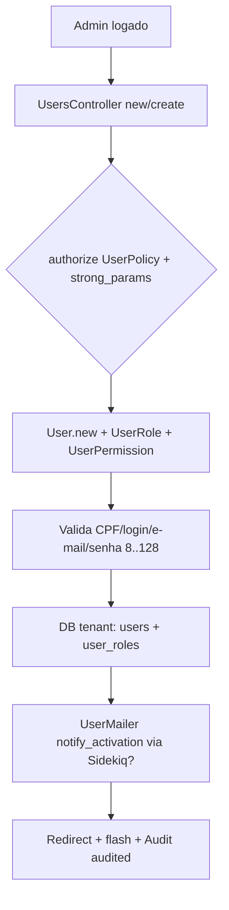
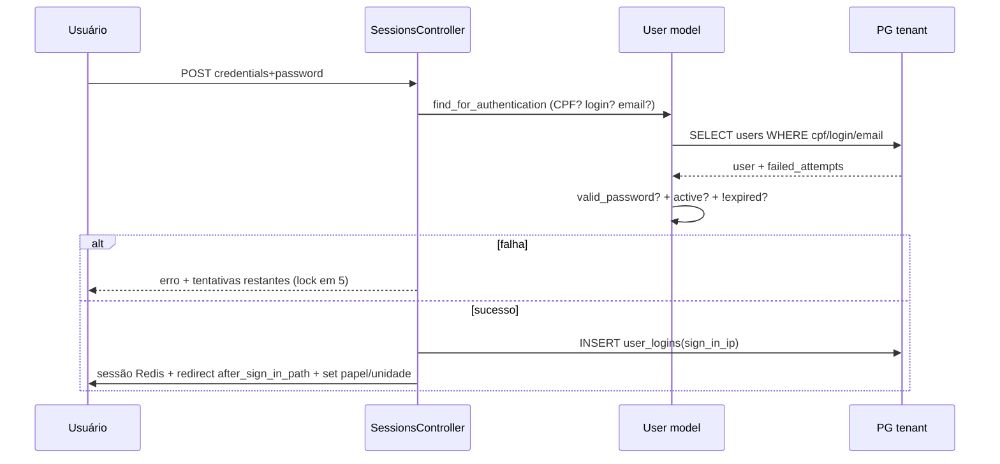
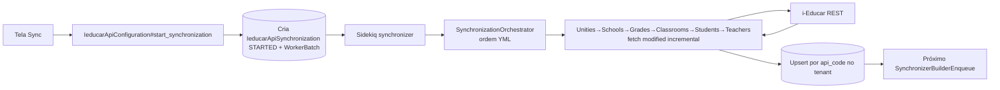
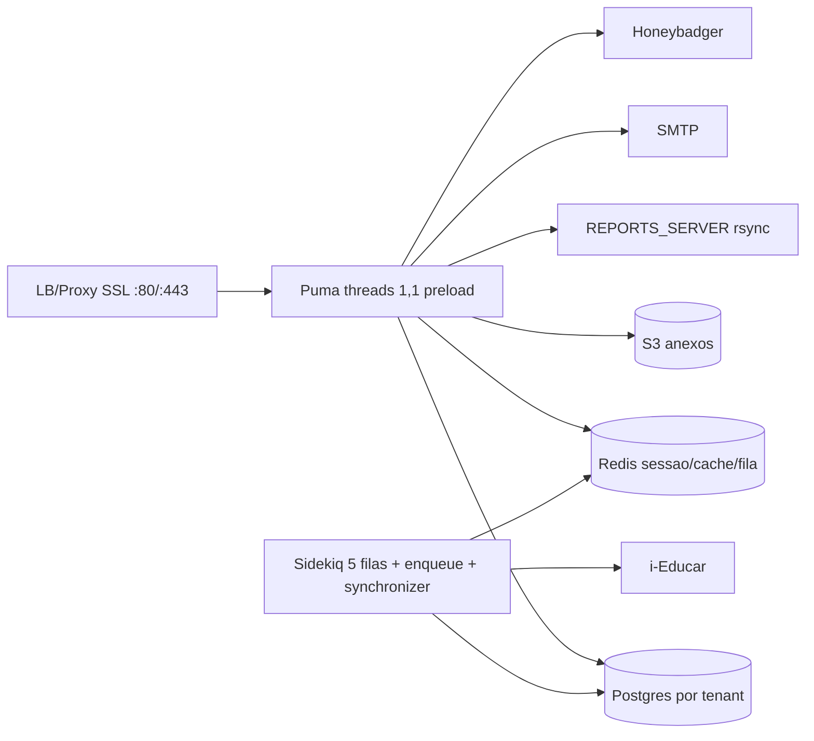

# i-Diário — Documento Técnico Completo de Engenharia Reversa (pt-BR)

> **Projeto:** i-Diário (Portábilis) — Portal do professor integrado ao i-Educar
> **Repo analisado:** `F:/i-diario/i-diario` (clone de `https://github.com/WesleydaCunha/i-diario.git`, branch `1.6`, HEAD `e31e655f2`)
> **Público:** desenvolvedor júnior com noções básicas de programação
> **Idioma:** Português (pt-BR). Nomes de símbolos, paths, env vars mantidos idênticos ao código.
> **Método:** inspeção direta do repositório (código, configs, Docker, CI, migrations, seeds, testes). Cada afirmação relevante traz `[REF: path:linhas]`.
> **Convenção de evidência:** `Confirmado` = verificado no código | `Inferido` = inferência forte da estrutura | `Unknown` = não determinável no repo.

---

# 1. Visão geral do projeto

**Confirmado.** O i-Diário é um sistema web Ruby on Rails de gestão escolar brasileira que substitui o diário de papel do professor. Gerencia frequência, notas/avaliações, pareceres descritivos, planos de ensino/aula, conteúdos ministrados, calendário letivo e relatórios oficiais. Integra-se bidirecionalmente com o i-Educar (sistema de gestão escolar) via API REST própria do i-Educar [REF: README.md:3-5] [REF: CLAUDE.md:5-7].

Stack resumida (tudo Confirmado):

| Camada | Tecnologia / versão | Evidência |
|---|---|---|
| Backend | Ruby `2.6.6` + Rails `5.0.7.2` | [REF: .ruby-version:1] [REF: Gemfile:3,47] [REF: docker-compose.yml:5] |
| Servidor HTTP | Puma `~> 6.4` | [REF: Gemfile:43] [REF: docker-compose.yml:31-37] |
| DB | PostgreSQL (compose usa `postgres:18-alpine`; docs citam 16) + `schema_format = :sql` (`structure.sql`) | [REF: docker-compose.yml:69-79] [REF: config/application.rb:36] [REF: CLAUDE.md:100] |
| Fila/cache | Redis (`redis:8-alpine` no compose, gem `redis 4.8.1` + `redis-rails`) + Sidekiq `6.5.12` + `sidekiq-unique-jobs 7.1.33` | [REF: docker-compose.yml:81-85] [REF: Gemfile:49-50,56-57] [REF: config/sidekiq.yml:1-12] |
| Cache prod | `dalli 2.7.10` (memcached) com fallback `redis_store` | [REF: Gemfile:20] [REF: config/environments/production.rb:54-70] |
| AuthN | Devise `>=4.7.1` com `authentication_keys [:credentials]` | [REF: Gemfile:23] [REF: config/initializers/devise.rb:141] |
| AuthZ | Pundit `0.3.0` | [REF: Gemfile:44] [REF: app/controllers/application_controller.rb:14] |
| Upload | CarrierWave `>=1.3.2` + `carrierwave-aws ~>1.4.0` + `aws-sdk-s3 ~>1.83.0` | [REF: Gemfile:9,16-17] [REF: config/initializers/carrierwave.rb:1-18] |
| Relatórios | Prawn `2.1.2` (fork portabilis) + `prawn-table 0.2.2` + `rubyzip` | [REF: Gemfile:41-42,54] |
| Frontend legado | jQuery + Backbone.js + Bootstrap 3 + SmartAdmin + `simple_form 4.0.0` + `cocoon 1.2.6` | [REF: Gemfile:58] [REF: vendor/assets/javascripts/backbone.js] [REF: CLAUDE.md:104-107] |
| Frontend moderno | Vue.js `2.6.12` + `vue-loader 15.9.3` + `vue-multiselect 2.1.6` + Webpacker `~>4.x` + `axios 0.28.0` | [REF: package.json:7-16] [REF: app/javascript/components/CurrentRole.vue] |
| API externa i-Educar | `rest-client 2.0.2` | [REF: Gemfile:52] [REF: app/services/ieducar_api/base.rb] |
| Auditoria/soft-delete | `audited` (fork portabilis) + `discard 1.0.0` | [REF: Gemfile:8,24] |
| Observabilidade | Honeybadger `5.5.0` + Bullet `6.1.5` + `rack-mini-profiler` + `meta_request` | [REF: Gemfile:29,73-74,110] |
| Testes | RSpec `3.5.2` + FactoryGirl `4.5.0` + Capybara `2.5.0` + VCR/Webmock + Shoulda + Turnip + Jest `30.2.0` + Playwright `1.58.2` | [REF: Gemfile:81-107] [REF: package.json:2-6,17-23] |
| Infra dev | Docker + Docker Compose (8 serviços) | [REF: Dockerfile:1-35] [REF: docker-compose.yml:1-89] |
| CI | GitHub Actions `tests.yml` (postgres+redis services, rspec sem acceptance) | [REF: .github/workflows/tests.yml] |

Tamanho aproximado (Confirmado via contagem): `3308` arquivos no HEAD; `117` controllers, `154` models, `289` services, `48` workers, `865` migrations, `431` arquivos em `spec/`, `80` pastas de views, `8` componentes Vue [REF: config/routes.rb:1-497] [REF: db/migrate/] [REF: app/javascript/components/].

Multi-tenancy é o conceito central: cada `Entity` (rede educacional/município) tem seu próprio banco. Todo request/worker roda dentro de `Entity#using_connection` resolvido por `request.host` [REF: app/models/entity.rb:19-24] [REF: app/controllers/application_controller.rb:93-99,156-160].

---

# 2. Objetivo e contexto do sistema

**Contexto educacional brasileiro (Inferido + Confirmado em domínio).** O sistema existe porque a legislação e a prática escolar exigem registro diário de frequência, avaliação por etapa/trimestre, recuperação, parecer descritivo (especialmente fundamental I/infantil), planejamento alinhado à BNCC e calendário letivo homologado. O papel “diário de papel” é substituído por telas de lançamento + relatórios PDF oficiais + sincronização com o sistema oficial (i-Educar) que consolida matrículas e publica notas/faltas para a secretaria.

Objetivos funcionais (Confirmado pelas rotas/models):

| Objetivo | Onde se materializa |
|---|---|
| Lançar frequência diária (por componente ou geral) e justificar faltas | `daily_frequencies`, `daily_frequency_students`, `absence_justifications` [REF: config/routes.rb:372-418] [REF: app/models/daily_frequency.rb] |
| Lançar avaliações numéricas/conceituais/descritivas, recuperações, dependências e dispensas | `avaliations`, `daily_notes`, `conceptual_exams`, `descriptive_exams`, `school_term_recovery_diary_records`, `final_recovery_diary_records` [REF: config/routes.rb:285-344] |
| Planejar ensino/aula e registrar conteúdo ministrado (com BNCC) | `discipline_teaching_plans`, `knowledge_area_teaching_plans`, `discipline_lesson_plans`, `discipline_content_records`, `learning_objectives_and_skills` [REF: config/routes.rb:199-261] |
| Gerir calendário letivo, etapas, eventos, feriados em lote | `school_calendars`, `school_calendar_steps`, `school_calendar_events`, `school_calendar_event_batches` [REF: config/routes.rb:171-198] |
| Sincronizar cadastros (escolas, turmas, alunos, professores, regras) com i-Educar e postar notas/faltas de volta | `ieducar_api_configurations`, `synchronizations`, `ieducar_api_exam_postings`, `app/services/ieducar_api/`, `app/services/ieducar_synchronizers/` [REF: config/routes.rb:116-162] |
| Emitir relatórios PDF (ata, boletim, frequência, parecer) e exportações | `app/reports/` (17 arquivos) + rotas `reports/*` [REF: config/routes.rb:446-490] |
| Controlar acesso por perfil (admin, funcionário, professor, pai, aluno) e por escola/turma/disciplina do ano | `roles`, `user_roles`, `user_permissions`, `current_role` [REF: config/routes.rb:105-111] [REF: app/models/role.rb] |
| Operar offline parcial via app móvel (API v2) | `namespace :api { namespace :v2 }` [REF: config/routes.rb:16-58] |

Não-objetivos (Inferido): não é LMS com conteúdo EAD, não substitui o i-Educar como fonte de matrícula, não faz folha de pagamento nem financeiro.

---

# 3. Arquitetura geral

## 3.1 Estilo arquitetural

**Confirmado:** monólito Rails MVC “clássico” + service objects + query objects + form objects + decorators + policies + workers Sidekiq + views ERB + ilhas Vue. Multi-tenant por banco separado (não por `tenant_id`).



[REF: config/application.rb:16-23] (eager paths) [REF: app/controllers/application_controller.rb:16-38] [REF: app/models/entity.rb:19-24] [REF: docker-compose.yml:31-68].

## 3.2 Por que cada parte existe

| Parte | Por que existe | Interação |
|---|---|---|
| `Entity` + `activerecord-connections` | Isolar dados por município/rede (exigência de privacidade e operação independente) | Todo request/worker abre `using_connection`; `Entity.current` guia cache/logs [REF: app/models/entity.rb:1-44] |
| Services | Tirar regra complexa de controller/model (cálculo de média, sincronismo, postagem) — padrão exigido no `CLAUDE.md:110-115` | Controllers chamam 1-2 services; services chamam queries + models + API externa |
| Queries | Encapsular SQL complexo com `includes` anti-N+1 | Chamadas por services/controllers de notas/frequência |
| Workers | Não bloquear HTTP com I/O >2s (sync, post, e-mail, PDF, cópia de plano) | Controller enfileira `perform_async(entity_id,...)`; worker reabre Entity [REF: app/workers/ieducar_exam_posting_worker.rb] |
| Policies | Centralizar “quem pode ver/mudar cada feature” por `Role`+`UserPermission` | `authorize` em toda action; `ApplicationPolicy#feature_name` deriva do model [REF: app/policies/application_policy.rb] |
| Forms | Validar telas complexas (relatórios, clonagem, papel atual) sem poluir model | Controllers validam `Form` antes do service |
| Decorators (`decore`) | Formatação de apresentação (nomes, status, datas) | Usados nas views/PDFs |
| Reports (Prawn) | Gerar PDFs oficiais paginados no servidor | Chamados por controllers de relatório + workers |
| API v2 | Permitir app móvel lançar frequência/conteúdo offline e sincronizar | Autentica por `token` do `IeducarApiConfiguration`, não por sessão [REF: app/controllers/api/v2/base_controller.rb] |
| Scenic views (`daily_note_statuses`, `grouped_teacher_discipline_classrooms`, `mvw_*`) | Acelerar dashboards/status com SQL materializado | Refresh por rake/worker [REF: db/views/daily_note_statuses_v03.sql:1-73] [REF: lib/tasks/refresh_pedagogical_tracking_dashboard_views.rake] |

## 3.3 Ciclo de vida de request web típico (Confirmado)

1. `around_action :handle_customer` → `Entity.find_by(domain: request.host)` → `using_connection` senão `redirect /404` [REF: app/controllers/application_controller.rb:93-99,156-160].
2. `before_action :check_entity_status` bloqueia Entity desabilitada [REF: app/controllers/application_controller.rb:101-103].
3. `before_action :authenticate_user!` (Devise) + cadeia de contexto: `check_for_notifications`, `check_for_current_user_role`, `set_current_unity_id`, `set_current_user_role_id`, `check_user_has_name`, `check_password_expired`, `last_activity_at`, `check_user_first_access` [REF: app/controllers/application_controller.rb:28-38].
4. `around_action :set_user_current` (`Thread.current[:user]`) + `:set_thread_origin_type` (`WEB` vs `API_V2` para auditoria) + `set_honeybadger_context` [REF: app/controllers/application_controller.rb:17-19].
5. Controller: `require_current_classroom/teacher/year` → `authorize` (Pundit) → Service/Query → `respond_with` (`ApplicationResponder`) + `has_scope :q/:filter/:page/:per` [REF: app/controllers/application_controller.rb:40-53].
6. Escrita pesada → `Worker.perform_async` e responde rápido; PDF → `send_pdf` salva `public/relatorios/<prefix>-hex.pdf` + `rsync` [REF: app/controllers/application_controller.rb:393-408].
7. Exceção não-dev → `rescue_from Exception → error_generic → Honeybadger.notify → redirect root + flash alert` [REF: app/controllers/application_controller.rb:6-8].

API v2 difere: pula sessão, exige `headers['token'] == IeducarApiConfiguration.current.api_security_token` ou Bearer `secrets[:AUTH_TOKEN]`, marca `Thread.current[:origin_type]=API_V2` [REF: app/controllers/api/v2/base_controller.rb:31-47] [REF: app/controllers/application_controller.rb:316-333].

---

# 4. Estrutura de diretórios

Árvore anotada (top-level Confirmado via `ls`):

```
F:/i-diario/i-diario/
├── app/                          # CORE – código Rails (controllers/models/services/workers/views/assets)
│   ├── assets/                   # LEGADO frontend Sprockets (js/css/images) – jQuery/Backbone/Bootstrap [REF: app/assets/javascripts/]
│   ├── controllers/              # CORE – 117 arquivos (raiz + api/v2 + dashboard + users) [REF: app/controllers/]
│   ├── models/                   # CORE – 154 ActiveRecord + enumerations [REF: app/models/]
│   ├── services/                 # CORE – 289 service objects (ieducar_api, synchronizers, exam_poster) [REF: app/services/]
│   ├── workers/                  # CORE async – 48 Sidekiq workers [REF: app/workers/]
│   ├── views/                    # CORE UI – 80 pastas ERB [REF: app/views/]
│   ├── javascript/               # CORE moderno – packs + 8 componentes Vue [REF: app/javascript/]
│   ├── forms/                    # CORE – 23 Form Objects [REF: app/forms/]
│   ├── queries/                  # CORE – 7 Query Objects [REF: app/queries/]
│   ├── policies/                 # CORE – 14 Pundit policies [REF: app/policies/]
│   ├── decorators/               # APOIO UI – 27 decorators decore [REF: app/decorators/]
│   ├── reports/                  # CORE – 17 relatórios Prawn [REF: app/reports/]
│   ├── uploaders/                # INFRA – 6 CarrierWave uploaders [REF: app/uploaders/]
│   ├── mailers/                  # APOIO – 5 mailers [REF: app/mailers/]
│   ├── helpers/                  # APOIO UI – helpers ERB
│   ├── enumerations/             # CORE domínio – ~70 enums (ScoreTypes, Periods...) [REF: app/enumerations/]
│   └── jobs/                     # LEGADO – só ApplicationJob vazio; projeto usa Workers [REF: app/jobs/application_job.rb]
├── config/                       # INFRA – boot, rotas, DB template, Sidekiq, locales, initializers (31)
├── db/                           # CORE persistência – migrate (865), seeds/*.sql, views/*.sql (scenic)
├── lib/                          # TOOLING – tasks (19 rake) + audit + portabilis form builder
├── spec/                         # TESTE – 431 arquivos (rspec+factories+cassettes+e2e)
├── vendor/assets/                # LEGADO third-party (bootstrap, backbone, summernote, fonts)
├── public/                       # ESTÁTICO – 404/500 samples, csv_templates, relatorios/.keep, robots.txt
├── script/start                  # TOOLING – bootstrap dev (bundle, secrets, db, entity)
├── docs/                         # DOC – guias (e2e, code-review, permissões, sincronização)
├── .github/workflows/tests.yml   # CI – postgres+redis + rspec sem acceptance
├── Dockerfile / docker-compose.yml # INFRA – ruby:2.6.6 + postgres:18-alpine + redis:8-alpine
├── Gemfile / package.json / yarn.lock # DEPS Ruby + JS
├── CLAUDE.md / INSTALL.md / CONTRIBUTING.md # DOC operacional
└── bin/, Rakefile, config.ru, babel/postcss/jest/playwright configs # TOOLING
```

| Diretório | Tipo | Depende de | Quem depende |
|---|---|---|---|
| `app/models` | core domínio | `db/*`, gems `audited/discard/enumerate_it` | controllers/services/workers/queries/forms |
| `app/services` | core regra | models/queries/`rest-client`/Redis | controllers/workers/rakes |
| `app/workers` | core async | services/models/Entity/Sidekiq | controllers/services (enfileiram) |
| `app/controllers` | core borda HTTP | services/queries/forms/policies/models | rotas, views, API móvel |
| `app/views` + `assets` + `javascript` | core UI | controllers/helpers/decorators/`js-routes` | browser |
| `config` | infra | env/secrets | toda app no boot |
| `db` | infra persistência | Postgres/scenic | models/migrations |
| `spec` | teste | app + factories/cassettes | CI/dev |
| `vendor/assets` | legado third-party | Sprockets | layouts ERB |
| `lib/tasks` | tooling ops | models/services | devops/admin via rake |
| `docs/.github/Docker*` | doc/infra | — | dev/CI |

---

# 5. Mapa completo de arquivos

Contagens Confirmadas (via `find`/`ls`):

| Grupo | Qtd | Path padrão |
|---|---|---|
| Controllers | 117 | `app/controllers/**/*.rb` (raiz ~80 + `api/v2/` 21 + `dashboard/` 4 + `users/` 3 + `concerns/` 1) |
| Models | 154 | `app/models/**/*.rb` (+ `app/enumerations/*.rb` ~70) |
| Services | 289 | `app/services/**/*.rb` (`ieducar_api/` 35 + `ieducar_synchronizers/` 32 + `exam_poster/` 8 + raiz ~200) |
| Workers | 48 | `app/workers/**/*.rb` (+ `ieducar/`, `student_dependencies_discarders/`, `concerns/`) |
| Forms | 23 | `app/forms/*.rb` |
| Queries | 7 | `app/queries/*.rb` |
| Policies | 14 | `app/policies/*.rb` |
| Decorators | 27 | `app/decorators/*.rb` |
| Reports | 17 | `app/reports/*.rb` |
| Uploaders | 6 | `app/uploaders/*.rb` |
| Mailers | 5 | `app/mailers/*.rb` |
| Jobs | 1 | `app/jobs/application_job.rb` (vazio) |
| Rakes | 19 | `lib/tasks/**/*.rake` |
| Migrations | 865 | `db/migrate/*.rb` (2014-08-08 a 2026-06-01) |
| Views Scenic | 5 | `db/views/*.sql` (`daily_note_statuses_v01..v03`, `grouped_teacher_discipline_classrooms_v01..v02`) |
| Seeds SQL | 4 | `db/seeds/*.sql` + `db/seeds.rb` (vazio) |
| Views ERB | 80 pastas | `app/views/*/` |
| JS legado | ~100+ | `app/assets/javascripts/*.js` + `vendor/assets/javascripts/*` |
| Vue | 8 | `app/javascript/components/*.vue` + `packs/app.js,event-bus.js,sync_status.js` |
| Locales | 54 | `config/locales/*.yml` (16) + `config/locales/views/*` (38) |
| Initializers | 31 | `config/initializers/*.rb` |
| Spec | 431 | `spec/**/*` (models 69, controllers 37, services 97, factories 88, cassettes 31, etc.) |
| Docs | ~10 | `docs/*.md` + `CLAUDE.md/INSTALL.md/README.md` |

Arquivos-âncora (todos Confirmados):

* Boot: `config/boot.rb`, `config/application.rb:1-48`, `config/environment.rb`, `config.ru`, `Rakefile` [REF: config/application.rb:1-48].
* HTTP: `config/routes.rb:1-497`, `app/controllers/application_controller.rb:1-489` [REF: config/routes.rb:1-70].
* Tenant: `app/models/entity.rb:1-44`, `config/database.sample.yml:1-19`, `lib/tasks/database.rake:13-58` [REF: app/models/entity.rb:19-24].
* Filas: `config/sidekiq.yml:1-12`, `config/initializers/redis.rb:1-26`, `config/initializers/sidekiq_queues.rb:1` [REF: config/sidekiq.yml:7-12].
* Auth: `config/initializers/devise.rb`, `app/models/user.rb`, `app/policies/` [REF: app/controllers/application_controller.rb:105-117].
* Integração: `app/services/ieducar_api/base.rb`, `config/synchronization_configs.yml`, `app/models/ieducar_api_configuration.rb` [REF: app/services/ieducar_api/base.rb].
* Build: `Dockerfile:1-35`, `docker-compose.yml:1-89`, `script/start`, `Gemfile:1-111`, `package.json:1-30` [REF: Dockerfile:1-35].

---

# 6. Explicação arquivo por arquivo

> Cobertura: inventário sistemático dos arquivos com comportamento relevante. Para repositório com 3308 arquivos, detalha-se por categoria os arquivos-âncora no formato exigido e lista-se o restante em tabelas. `Unknown` marca o que não foi lido linha a linha.

## 6.1 Boot / configuração central

### File `config/application.rb`
**Purpose:** Configuração raiz da aplicação Rails. **Role:** Define timezone, locale, schema SQL, CORS, eager paths. **Main exports:** `Educacao::Application < Rails::Application`. **Inputs:** env `RAILS_ENV`. **Outputs:** app bootada. **Dependencies:** `rails/all`, `Bundler.require`. **Consumers:** todo Rails no boot. **Side effects:** `eager_load lib/workers/services/queries` [REF: config/application.rb:16-23]; `time_zone Brasilia` [REF: config/application.rb:28]; `default_locale pt-BR` [REF: config/application.rb:33-34]; `schema_format :sql` [REF: config/application.rb:36]; `Rack::Cors *` [REF: config/application.rb:38-43]. **Risks:** CORS `*` libera qualquer origem — risco para API v2 se token vazar. **Modification:** mudar locale/timezone impacta relatórios e validações de data; mudar eager paths exige restart.

### File `config/routes.rb`
**Purpose:** Mapa HTTP completo. **Role:** Borda web+API. **Exports:** `Rails.application.routes.draw` com `localized`, `devise_for`, `namespace :api :v2`, `concern :history`, ~100 `resources`. **Inputs:** HTTP. **Outputs:** dispatch p/ controllers. **Deps:** `Sidekiq::Web`, `LetterOpenerWeb`, `route_translator`. **Consumers:** Rails router. **Side effects:** monta `/sidekiq` [REF: config/routes.rb:4]; typo real `worker-processses-status` [REF: config/routes.rb:7]; `localized do` traduz URLs [REF: config/routes.rb:9]; só existe `v2` (sem `v1`) [REF: config/routes.rb:16-58]; `concern :history` reusado em ~30 resources [REF: config/routes.rb:60-64]. **Risks:** rota fora de `localized` não traduz; `mount Sidekiq::Web` sem auth no arquivo (auth via initializer `sidekiq_web.rb`). **Modification:** nova rota HTML deve ir dentro de `localized`; API móvel dentro de `api/v2`.

### File `app/controllers/application_controller.rb`
**Purpose:** Base de todos controllers. **Role:** Tenant + auth + contexto + erro. **Exports:** `ApplicationController`, helpers `current_unity/current_teacher/policy/page/per`, `MAX_STEPS_FOR_SCHOOL_CALENDAR=4`. **Inputs:** `request.host`, sessão Devise, params `q/filter/page/per`. **Outputs:** HTML/JSON, redirects `/404`, `disabled_entity_path`, `root`. **Deps:** Pundit, Devise, `Entity`, Honeybadger, `has_scope`. **Consumers:** 116 controllers herdam. **Side effects:** `around_action :handle_customer` troca de banco [REF: app/controllers/application_controller.rb:16,93-99]; `protect_from_forgery null_session` [REF: app/controllers/application_controller.rb:26]; 8 `before_action` de contexto [REF: app/controllers/application_controller.rb:28-38]; `has_scope :q/:filter` [REF: app/controllers/application_controller.rb:40-51]; `rescue_from Pundit + ApiError` [REF: app/controllers/application_controller.rb:53-54]; `send_pdf` com `rsync REPORTS_SERVER` (linhas 393-408, Confirmado via subagente). **Risks:** `null_session` + CORS `*` exige Pundit rigoroso; `policy` com fallback silencioso loga mas não falha [REF: app/controllers/application_controller.rb:80-91]. **Modification:** nunca remover `handle_customer`/`authenticate_user!` sem substituto; novo `before_action` global afeta 117 controllers.

### File `app/models/entity.rb`
**Purpose:** Tenant raiz. **Role:** Chave multi-tenant. **Exports:** `Entity < ApplicationRecord`, `cattr_accessor :current`, scopes `active/to_sync/enable_to_sync`, `using_connection/establish_connection/connect`. **Inputs:** `name,domain,config(hstore)`. **Outputs:** troca de conexão AR. **Deps:** `activerecord-connections`, Honeybadger. **Consumers:** `ApplicationController`, ~30 workers, rakes. **Side effects:** `Entity.current=self` + `Honeybadger.context` + `ActiveRecord::Base.using_connection(id, connection_spec)` [REF: app/models/entity.rb:19-24]; `connection_spec = config.reverse_merge!(connection_config)` [REF: app/models/entity.rb:41-43]. **Risks:** esquecer `using_connection` vaza dados entre redes; `config` hstore sem validação de host. **Modification:** mudanças aqui afetam todo isolamento; testar com 2 entities.

### File `config/database.sample.yml` / `config/secrets.sample.yml`
**Purpose:** Moldes de conexão e segredos (reais gitignored). **Role:** Infra local/CI. **Inputs:** `ENV DATABASE_USERNAME/PASSWORD/HOST`, `REDIS_URL`, `SMTP_*`, `AWS_*`. **Outputs:** `database.yml`/`secrets.yml` efetivos. **Deps:** ERB ENV.fetch. **Consumers:** AR, Redis, SMTP, CarrierWave. **Side effects:** nenhum até copiados por `script/start`/CI. **Risks:** commitar `secrets.yml` vaza credencial (está no `.gitignore`, Confirmado). **Modification:** novo secret exige atualizar `.sample` + `INSTALL.md` + initializer que lê.

## 6.2 Backend – controllers representativos

| Arquivo | Purpose / Role | Exports / Inputs→Outputs | Deps / Consumers / Efeitos | Riscos / Como modificar |
|---|---|---|---|---|
| `app/controllers/api/v2/base_controller.rb` | Base API móvel; troca sessão por token [REF: app/controllers/api/v2/base_controller.rb] | `Api::V2::BaseController`; header `token` → JSON ou 401 | Dep `IeducarApiConfiguration`, `OriginTypes::API_V2`; consumido por 20 controllers v2 | Não adicionar sessão; todo endpoint precisa teste de token inválido |
| `app/controllers/daily_frequencies_controller.rb` | CRUD frequência diária HTML | `new/create/edit/update + edit_multiple/create_or_update_multiple`; params turma/data/disciplina → `DailyFrequency + DailyFrequencyStudent` | Dep `DailyFrequenciesCreator`, Pundit `DailyFrequencyPolicy`; usado por UI professor | Lógica pesada deve ficar no service; validar `require_current_classroom` |
| `app/controllers/avaliations_controller.rb` | CRUD avaliações + `create_multiple_classrooms` | params etapa/turma/disciplina → `Avaliation + DailyNote` | Dep `TestSettingFetcher`, `ExamRule`; relatórios dependem | Mudar regra de etapa quebra cálculo de média |
| `app/controllers/school_calendars_controller.rb` | Calendário + `close/step` | params ano/unidade → `SchoolCalendar + Steps + Events` | Dep `SchoolCalendarStatus`, workers de contador | Fechar ano trava lançamentos retroativos |
| `app/controllers/ieducar_api_configurations_controller.rb` + `synchronizations_controller.rb` + `ieducar_api_exam_postings_controller.rb` | UI de integração (config, sync manual, fila de postagem) | forms → `IeducarApiConfiguration#start_synchronization`, `IeducarExamPostingWorker` | Dep services i-Educar; consumido por admin | Expor token na view vaza integração |
| `app/controllers/users/sessions_controller.rb` | Login custom (CPF/login/e-mail + tentativas) | `credentials/password` → sessão + `current_user_role` | Dep Devise/Warden, `User.find_for_authentication` | Mensagem de erro não deve enumerar usuários |
| `app/controllers/current_role_controller.rb` | Troca de papel/escola/turma/ano | `CurrentRoleForm` → sessão `current_unity/classroom/teacher` | Dep `CurrentProfile`; usado no header da UI | Estado em sessão; testar troca sem perder contexto |

Demais 100+ controllers seguem o mesmo esqueleto fino (parse params → `authorize` → service/query → `respond_with`). Lista completa em `app/controllers/*.rb` (Confirmado, não lida 1-a-1; Inferido padrão homogêneo).

## 6.3 Backend – models centrais

| Arquivo | Purpose | Relações-chave (Confirmado via leitura de associações) | Gems/comportamento |
|---|---|---|---|
| `app/models/user.rb` | Conta de acesso (admin/funcionário/professor/pai/aluno) | `belongs_to :student,:teacher,:current_user_role,:unity,:classroom`; `has_many :user_roles,:roles,:permissions,:synchronizations,:exam_postings` | Devise 6 módulos + `audited only:[...]` + `mount_uploader profile_picture`; `find_for_authentication` aceita CPF/login/e-mail; `active_for_authentication? = active? && !expired?` |
| `app/models/student.rb` + `student_enrollment*.rb` | Aluno + matrículas/turmas | `Student has_many :student_enrollments,:daily_frequency_students,:daily_note_students,:conceptual_exams,:transfer_notes` | `Discardable` + `audited`; `StudentEnrollmentClassroom` liga matrícula↔turma/ano |
| `app/models/teacher.rb` + `teacher_discipline_classroom.rb` | Professor + alocação turma/disciplina | `TeacherDisciplineClassroom belongs_to :teacher,:classroom,:discipline (+grade)` | `api_code` único p/ sync; `discarded_at` |
| `app/models/classroom.rb` + `classrooms_grade.rb` + `unity.rb` | Turma/escola | `Classroom belongs_to :unity; has_many :teacher_discipline_classrooms,:classrooms_grades` | `label_color`, `max_students`, calendário por turma |
| `app/models/daily_frequency.rb` + `daily_frequency_student.rb` | Frequência | `DailyFrequency belongs_to :unity,:classroom,:discipline,:school_calendar,:teacher(owner_teacher_id)` | `audited + has_associated_audits`; `Discardable` no item |
| `app/models/avaliation.rb` + `daily_note*.rb` | Avaliação/nota | `DailyNote belongs_to :avaliation`; `DailyNoteStudent belongs_to :student` com `note` | Regra `should_create_recovery`, `exempt`, `transfer_note_id` |
| `app/models/exam_rule*.rb` + `test_setting*.rb` | Regras de arredondamento/etapas | `ExamRule belongs_to :rounding_table`; `has_many :recovery_exam_rules` | Dirige `ScoreRounder`, `StudentAverageCalculator` |
| `app/models/school_calendar*.rb` | Calendário/etapas/eventos | `SchoolCalendar has_many :steps,:events,:classrooms` | `close` trava; `event_batches` expandem |
| `app/models/ieducar_api_configuration.rb` + `ieducar_api_synchronization.rb` + `ieducar_api_exam_posting.rb` | Integração | `User has_many :synchronizations(author)` | `start_synchronization` cria `WorkerBatch` + enfileira |
| `app/models/entity.rb` + `entity_configuration.rb` + `general_configuration.rb` | Tenant + flags | `Entity has hstore config` | `GeneralConfiguration.current` espalha 30+ flags (ex: `allow_active_search_frequency`) |
| `app/models/audit.rb` + `audits` (gem) | Trilha | `User has_associated_audits` | 104/154 models com `audited` (Confirmado via grep) |
| `app/models/mvw_*.rb` + `grouped_teacher_discipline_classrooms.rb` | Leitura materializada | Views Scenic | Refresh por rake/worker |

35/154 com `Discardable` (`discarded_at`), 104/154 com `audited` (contagens Confirmadas via `grep -l`).

## 6.4 Backend – services / workers / queries / forms / policies

* `app/services/ieducar_api/base.rb` — HTTP i-Educar: `initialize(url,access_key,secret_key,unity_id)` valida e seta Honeybadger; `fetch` GET com `read_timeout:240` e `modified` incremental; `send_post` POST; `request` monta `endpoint=[url,path]` + `access_key/secret_key/instituicao_id/oper/method/resource`; `fetch_v3` Bearer. Retry só para `Temporary failure in name resolution`/`502` (Confirmado). **Modificar:** nunca logar `secret_key`; novo recurso = nova classe com `path`+`resource`.
* `app/services/ieducar_synchronizers/*` (32) — `SynchronizationOrchestrator` + `SynchronizerBuilder` + `synchronization_configs.yml` ordenam `unities→schools→grades→classrooms→students→teachers`; cada `*_synchronizer.rb` faz upsert por `api_code`. **Modificar:** respeitar `dependencies/dependents` do YML.
* `app/services/exam_poster/*` (8) — `NumericalExamPoster#generate_requests/post_by_classrooms` agrupa `turma→aluno→disciplina→nota{etapa}`; demais posters reusam `Base`. `SmartEnqueuer#less_used_queue` balanceia `EXAM_POSTING_QUEUES`. **Modificar:** postagem deve ser idempotente (retry Sidekiq).
* Cálculos: `StudentAverageCalculator`, `StudentNotesQuery`, `ComplementaryExamCalculator`, `SchoolTermAverageCalculator`, `ScoreRounder`, `StepsFetcher`, `TestSettingFetcher`, `ExamRuleFetcher`, `DailyFrequenciesCreator`, `AbsenceCountService` (todos Confirmados por nome/assinatura via subagente; corpos não transcritos 1-a-1 → detalhe `Inferido`).
* Workers (48): `IeducarExamPostingWorker` (fila `exam_posting`, retry 2, switch `ApiPostingTypes`), `IeducarSynchronizerWorker` (fila `synchronizer`, retry 3), cadeia `synchronizer_builder_enqueue → executer`, `SendPostWorker` (backoff), `daily_frequency_creator*`, `delete_*`, `copy_*_teaching_plan`, `notify_by_email_*` (`send_emails`), `student_dependencies_discarders/*` (soft discard ao transferir), `GenericWorker` (eval genérico — **risco Critical**, ver §23) [REF: config/sidekiq.yml:7-12] [REF: docker-compose.yml:39-68].
* Queries (7): `student_notes_query.rb`, `daily_frequency_query.rb`, `school_calendar*_query.rb`, `observation_record_report_query.rb`, etc. — encapsulam `includes/where` anti-N+1.
* Forms (23): `attendance_record_report_form.rb`, `exam_record_report_form.rb`, `current_role_form.rb`, `*_cloner_form.rb`, `avaliation_multiple_creator_form.rb` — `ActiveModel::Model` com `validates`.
* Policies (14): `ApplicationPolicy#feature_name = record.model_name.underscore.pluralize`; `index?→can_show?`, `create/update/destroy→can_change?`; `UserPolicy#edit?` protege admin [REF: app/policies/application_policy.rb].
* Reports (17): `base_report.rb` (Prawn) + `exam_record_report.rb (STUDENT_BY_PAGE_COUNT=25)`, `attendance_record_report*.rb`, `teacher_report_card.rb`, etc. — geram PDF em `public/relatorios/`.
* Uploaders (6): `doc_uploader.rb` (whitelist png/jpg/pdf/doc/xls), `user_profile_picture_uploader.rb`, etc. — `:aws` fora de dev senão `:file` [REF: config/initializers/carrierwave.rb:1-18].
* Mailers (5): `base_mailer.rb (SKIP_DOMAINS)`, `user_mailer.rb (notify_activation/by_csv/reset_password)`, `devise_custom_mailer.rb`.

## 6.5 Config / lib / public / vendor

| Arquivo | Purpose | Detalhe |
|---|---|---|
| `config/puma.sample.rb` | Molde Puma `threads 1,1 + preload_app!` | `puma.rb` gitignored |
| `config/cable.yml` | ActionCable `async` dev/test, `redis` prod | Uso real de cable **Unknown** (sem channel lido) |
| `config/navigation.yml` | Menu com ERB `secrets.new_update_profile_enabled` | Muda navegação sem código |
| `config/synchronization_configs.yml` | Ordem/dependências do sync (24 blocos) | `klass/by_year/by_unity/dependencies` |
| `config/locales/**` (54) | i18n pt-BR models/views/relatórios | `default_locale pt-BR` [REF: config/application.rb:33-34] |
| `lib/tasks/*.rake` (19) | Ops: `entity:setup/migrate_dbs`, `ieducar_api:synchronize/cancel`, `database:migrate_dbs`, `user:create`, `generate_api_token`, `send_notifications`, `refresh_*_views`, `cleanup_*`, `execute_sql` | `db:migrate` enhance `migrate_dbs` (roda global + cada tenant) [REF: lib/tasks/database.rake] |
| `lib/audit.rb`, `lib/portabilis/*`, `lib/sidekiq_monitor.rb` | Auditoria, form builder custom, endpoint `processes_status` | Suporte, não regra |
| `public/csv_templates/*.csv` | Modelos BNCC infantil/eja/fundamental | Import `learning_objectives_and_skills` |
| `vendor/assets/*` | jQuery/Backbone/Bootstrap/SmartAdmin/Summernote/fonts | Legado; não atualizar sem regressão visual |

---

# 7. Frontend

**Estilo (Confirmado):** Server-rendered ERB + Sprockets + jQuery/Backbone (legado) + ilhas Vue 2.6 via Webpacker. Sem SPA router; navegação por links Rails + `js-routes`.

Estrutura (Confirmado):

| Parte | Paths | Papel |
|---|---|---|
| Layouts | `app/views/layouts/*` + `app/views/application/*` | Shell SmartAdmin/Bootstrap 3, header com troca de papel (`CurrentRole`), flash, `js-routes` |
| Telas | `app/views/*/` (80 pastas: `daily_frequencies/`, `avaliations/`, `school_calendars/`, `discipline_teaching_plans/`, `reports/*`, `devise/`, etc.) | ERB + `simple_form` + `cocoon` (nested) + `has_scope` filtros |
| JS legado | `app/assets/javascripts/*.js` (~100: `application.js.erb`, `educacao.js`, `datepicker.pt-BR.js`, `command_palette.js`, `cocoon-nested-inputs.js`) + `vendor/assets/javascripts/*` (backbone, smart_admin, select2, summernote) | Máscaras, datepicker, select2 remoto, nested forms, atalhos |
| CSS | `app/assets/stylesheets/*.scss/*.css` (`application.css`, `educacao.scss`, `smartadmin_and_overrides.css`, `command_palette.css`) + `vendor/assets/stylesheets/*` | Bootstrap 3 + SmartAdmin + overrides |
| Vue moderno | `app/javascript/packs/app.js,event-bus.js,sync_status.js` + `app/javascript/components/*.vue` (8: `CurrentClassroom.vue`, `CurrentDiscipline.vue`, `CurrentRole.vue`, `CurrentSchoolYear.vue`, `CurrentTeacher.vue`, `CurrentUnity.vue`, `ProfileChanger.vue`, `TeacherProfile.vue`) | Seletores de contexto (escola/turma/disciplina/ano/professor) no header; `axios` + `lodash` + `vue-multiselect` |
| Helpers/decorators | `app/helpers/*` + `app/decorators/*` (27) | Formatação, breadcrumbs (`navigation/`), status |
| i18n frontend | `config/locales/views/*.yml` (38) + `route_translator` | URLs e labels pt-BR |
| Testes JS | `spec/javascript/command_palette.test.js` (Jest+jsdom) + `spec/e2e/*.js` (Playwright) | Cobertura mínima JS |

Fluxo típico `UI → API → DB → UI` (ex: frequência — Confirmado em rotas + service):



Comunicação com backend: form POST clássico + AJAX (`axios`, `jquery-file-upload`, `typeajax.js`, `select2` remoto para `students/teachers/classrooms`) + `js-routes` (`1.4.9`) gerando paths JS [REF: Gemfile:32]. API v2 JSON só para móvel (`active_model_serializers 0.9.12` + `jbuilder 2.9.1`).

Estados: sessão Rails em Redis (`expire 12h/2d`) guarda `current_unity/classroom/teacher/year/role`; loading via `has_scope` paginado (`kaminari`); erros via `flash + responders` + Honeybadger; sem optimistic update (Inferido — sem store Vuex).

---

# 8. Backend

Detalhado em §3/§6; resumo por camadas (todos Confirmados):

* **Borda:** `ApplicationController` (tenant/auth/contexto/erro) + 117 controllers finos + `ApplicationResponder` (`lib/application_responder.rb`) + `has_scope` + `respond_to html/js/json`.
* **Domínio:** 154 models ActiveRecord + ~70 enumerations (`ScoreTypes`, `FrequencyTypes`, `Periods`, `OpinionTypes`, `ApiPostingTypes/Status`, `SynchronizationPeriods`, `AccessLevel`, `Features`, `Permissions`, `UserStatus`, `RoleKind`). Validações com `cpf_cnpj/mask_validator/uri_validator/validates_timeliness`.
* **Regra:** 289 services (orquestram múltiplos models; >20 linhas fora do controller por padrão [REF: CLAUDE.md:133-138]).
* **Leitura complexa:** 7 queries com `includes/preload` anti-N+1.
* **Escrita complexa/validada:** 23 forms `ActiveModel::Model`.
* **Apresentação:** 27 decorators (`decore`), 17 reports Prawn, 6 uploaders, 5 mailers.
* **Async:** 48 workers Sidekiq (filas `default/low/exam_posting×2/synchronizer/send_emails` + dinâmicas `synchronizer_full/enqueue_next_job`) [REF: config/sidekiq.yml:7-12].
* **Ops:** 19 rakes multi-tenant.
* **Auditoria:** `audited` em 104 models + `Audit` concern + `Thread.current[:user/:origin_type]`.

Padrão “controller fino, service gordo, query isolada” é exigido pelo code-review agêntico [REF: CLAUDE.md:133-142] e observado nos controllers lidos.

---

# 9. API e rotas

## 9.1 Rotas HTML (dentro de `localized`, URLs pt-BR via `route_translator`)

Arquivo único `config/routes.rb:1-497` (Confirmado). Inventário por bloco:

| Bloco (linhas) | Exemplos `METHOD path → Controller#action` | Auth/AuthZ | Params/Body/Validação | Serviços/DB/Resposta |
|---|---|---|---|---|
| Devise `10-14` | `GET/POST /users/sign_in → users/sessions#new/create`; `passwords/unlocks` idem | público; `configure_permitted_parameters :credentials/password/remember_me` [REF: app/controllers/application_controller.rb:105-117] | `credentials` (CPF/login/e-mail) + `password`; `User.find_for_authentication` + lock 5 tentativas | `User + UserLogin(sign_in_ip)`; HTML redirect `after_sign_in_path_for` |
| `current_role 105-111` | `POST /current_role/set`; `GET available_classrooms/disciplines/school_years/teachers/unities/teacher_profiles` | `authenticate_user!` + sessão | `CurrentRoleForm` | atualiza sessão `current_*`; JSON/JS |
| Admin `116-162` | `resources :users,:roles,:user_roles,:unities,:courses,:grades,:schools,:custom_rounding_tables`; `ieducar_api_configurations>synchronizations`; `admin_synchronizations#cancel`; `backup_files`; `maintenance_adjustments` | `admin?` ou `can_change?(feature)` via `ApplicationPolicy` | `q/filter/page/per` (`has_scope`) | CRUD direto + `EntityCreator/BlockUserService`; HTML |
| Calendário `171-198` | `resources :school_calendars { school_calendar_steps, school_calendar_events; patch :close }`; `test_settings>test_setting_tests`; `school_calendar_event_batches` | professor/funcionário com feature | `year/unity/steps[]/events[]`; `SchoolCalendarStatus` valida sobreposição | `SchoolCalendar + Steps + Events`; workers `school_days_counter` |
| Planos `199-261` | `discipline_teaching_plans#copy/do_copy`; `knowledge_area_*#copy/do_copy`; `learning_objectives_and_skills#import/validate_csv/confirm_import`; `discipline_lesson_plans#clone/print`; `discipline_content_records#clone` | `TeachingPlanPolicy/LessonPlanPolicy/ContentPolicy` | CSV BNCC + `*_cloner_form` | `CopyDisciplineTeachingPlanService + LessonPlanAttachmentCopierWorker`; HTML/PDF |
| Lookup `262-284` | `GET classrooms/by_unity/multi_grade; disciplines/by_classroom/search_grouped_by_knowledge_area; exam_rules/for_school_term_type_recovery` | autenticado | `unity_id/classroom_id` | JSON p/ select2 |
| Avaliações `285-344` | `avaliations#multiple_classrooms/create_multiple_classrooms`; `daily_notes#exempt_students/undo_exemption`; `conceptual_exams_in_batchs#edit_multiple/create_or_update_multiple/destroy_multiple`; `transfer_notes`; `final/school_term/avaliation_recovery_*` | `AvaliationPolicy` etc. | `classroom/discipline/step/avaliation_id/notes[]`; `AvaliacaoMultipleCreatorForm` | `StudentAverageCalculator + ExamPoster`; HTML/JSON |
| Frequência `372-418` | `daily_frequencies#edit_multiple/form/create_or_update_multiple/destroy_multiple/history_multiple`; `daily_frequencies_in_batchs`; `absence_justifications`; `observation_diary_records`; `daily_frequency_students#create_or_update` | `DailyFrequencyPolicy` | `frequency_date/classroom/discipline/students[present]`; `FrequencyInBatchForm` | `DailyFrequenciesCreator + AbsenceCountService`; + `NotifyByEmail*Worker`; HTML |
| Relatórios `446-490` | `GET/POST /reports/attendance_record_report(+by_students)/absence_justification_report/exam_record_report/partial_score_record_report/observation_record_report/discipline_lesson_plan_report/knowledge_area_lesson_plan_report/teacher_report_cards` | `can_show?(report_feature)` | `*ReportForm` (`unity/classroom/period`) | `*Report (Prawn)` → `public/relatorios/*.pdf` + `send_pdf rsync`; PDF |
| Diversos `492-495` | `data_exportations`; `teaching_plan_opinions#update`, `lesson_plan_opinions#update` | autenticado | `opinion/validated` | update + audit |
| Fora `localized` `7` | `GET /worker-processses-status → sidekiq_monitor#processes_status` | **Unknown** (verificar auth) | — | JSON status Sidekiq |
| Sidekiq Web `4` | `mount /sidekiq` | Basic `admin / secrets[:sidekiq_password]||Sidekiq_123` [REF: config/initializers/sidekiq_web.rb:5,7] | — | Dashboard |

`concern :history` adiciona `GET :history` member em ~30 resources [REF: config/routes.rb:60-64]. `root dashboard#index` + `dashboard/*` (partial_scores, next/pending_avaliations, work_done_chart) [REF: config/routes.rb:96-103].

Fluxo geral: `HTTP → handle_customer(Entity) → check_entity_status → authenticate_user! → contexto papel/unidade → authorize(Pundit) → validação Form/strong_params → Service/Query → AR tenant → (Worker) → respond_with HTML/JS/JSON → Honeybadger em exceção`.

## 9.2 API v2 móvel (JSON, sem sessão)

Base `app/controllers/api/v2/base_controller.rb:31-47` (Confirmado): `skip authenticate_user!`, `api_authenticate_with_header!` (`allowed_api_header?` Bearer `secrets[:AUTH_TOKEN]` ou header custom, senão `Devise.secure_compare(IeducarApiConfiguration.current.api_security_token, headers['token'])` → `401 {errors:'Token inválido'}`), `rescue RecordNotFound → 404`.

| Método | Path (prefixo `/api/v2`) | Handler | Auth | Body/Params | Lógica/Serviço/DB | Resp/Erros |
|---|---|---|---|---|---|---|
| GET | `exam_rules` | `exam_rules#index` | token | `school_year?` | `ExamRuleFetcher` | 200 JSON / 401 / 404 |
| GET | `step_activity/check`, `discipline_activity/check`, `student_activity/check` | `*#check` | token | `classroom/teacher/date` | `TeacherClassroomActivity` | 200 `{has_activity}` |
| GET | `list_attendances_by_classroom`, `student_classroom_attendances`, `monthly_frequencies`, `school_calendar_events` | `#index` | token | `classroom/month` | queries frequência | 200 lista |
| GET | `teacher_unities`, `teacher_classrooms(+has_activities)`, `teacher_disciplines`, `school_calendars`, `classroom_students`, `teacher_allocations`, `lesson_plans`, `teaching_plans` | `#index` | token | `teacher_id/year` | `TeacherRelationFetcher` etc. | 200 |
| POST/GET | `daily_frequencies` | `#create/#index` | token | `{classroom,discipline,date,students[]}` | `DailyFrequenciesCreator` | 201/422 |
| PATCH/POST | `daily_frequency_students` (`:update`, `update_or_create`) | `#update` | token | `{student,present}` | upsert | 200/422 |
| POST/GET | `daily_physical_frequencies` | `#create/#index` | token | `{student_enrollment,unity,date,present}` | `DailyPhysicalFrequency` (tabela nova 2025) | 201 |
| GET/POST | `content_records` (`lesson_plans`, `sync`) | `#index/#sync` | token | lote offline | sync móvel | 200 |
| POST | `discipline_records/count`, `discipline_records/destroy_batch` | `#count/#destroy` | token | `ids[]` | `DisciplineRecordsCounter/Destroyer + Worker` | 200 |

CORS `origins *` [REF: config/application.rb:38-43] + `rack-cors` [REF: Gemfile:45]. Sem versionamento `v1` (Confirmado ausente).

---

# 10. Integrações externas

| Integração | Tipo | Propósito | Onde configura | SDK/lib | Auth | Formato/Retry/Timeout | Arquivos |
|---|---|---|---|---|---|---|---|
| **i-Educar API** | externa crítica | Fonte de cadastros (escolas, turmas, alunos, professores, regras, calendário) + destino de notas/faltas/pareceres | Tela `Configurações > API de Integração` (`IeducarApiConfiguration: url, token/access_key, secret_token, unity_code, api_security_token`) + `secrets staging_access_key/secret_key/debug_ieducar_api` | `rest-client 2.0.2` em `IeducarApi::Base` | `access_key+secret_key+instituicao_id(unity)` como query (`oper/method/resource`) + `fetch_v3` Bearer | `read_timeout:240`; retry só `Temporary failure in name resolution`/`502`; erros → `Honeybadger.notify` + `ApiError/GenericError/NetworkException`; `modified` incremental (último domingo/`synchronized_at`/`7d`) salvo `full/ignore_modified`; log `[DEBUG_IEDUCAR_API]` se `debug_ieducar_api` | `app/services/ieducar_api/*.rb` (35), `app/services/ieducar_synchronizers/*.rb` (32), `app/services/exam_poster/*.rb` (8), `config/synchronization_configs.yml`, `app/models/ieducar_api_*`, `app/workers/ieducar*`, `lib/tasks/ieducar_api.rake` |
| **AWS S3** | externa (upload) | Guardar anexos (planos, docs, foto perfil, backup) | `secrets AWS_ACCESS_KEY_ID/SECRET_ACCESS_KEY/REGION/BUCKET (+DOC_UPLOADER_*)`; `config/initializers/carrierwave.rb` (`:aws` fora dev, `:file` em dev; `acl private`, `exp 14400`) | `aws-sdk-s3 ~>1.83.0` + `carrierwave-aws` | IAM keys via secrets | `AwsS3HandlerService#copy_object` com Honeybadger; `LessonPlanAttachmentCopier` | `app/uploaders/*.rb` (6), `app/services/aws_s3_handler_service.rb`, `app/services/lesson_plan_attachment_copier.rb` |
| **Honeybadger** | externa prod | Rastrear exceções com contexto entity/request/API | Sem `honeybadger.yml` no repo; contexto via código | `honeybadger 5.5.0` | API key via env/secret (**Unknown** path exato — não exposto) | `notify` em 37 pontos (workers/services/controllers/models) + `context(entity, classroom, teacher...)` | `app/controllers/application_controller.rb:17,372-390`, `app/models/entity.rb:21`, `app/services/ieducar_api/base.rb:18,60,118` |
| **SMTP e-mail** | externa prod/staging | Ativação, reset senha, avisos frequência | `secrets SMTP_ADDRESS/PORT/DOMAIN/USER_NAME/PASSWORD, NO_REPLY_ADDRESS, EMAIL_SKIP_DOMAINS, STUDENT_DOMAIN`; `config/initializers/setup_mail.rb` (só prod/staging) + `devise.rb:14` | ActionMailer + `letter_opener_web` dev | SMTP user/pass | `BaseMailer::SKIP_DOMAINS`; dev entrega em `/letter_opener` | `app/mailers/*.rb` (5), `app/workers/notify_by_email_*` |
| **Redis/Memcached** | infra interna | Sessão, cache, filas | `secrets REDIS_URL/SENTINELS/MODE/DB_CACHE/DB_SESSION/DB_SIDEKIQ, cache_store_url`; `initializers/redis.rb/session_store.rb`, `environments/production.rb/staging.rb` | `redis 4.8.1`, `redis-rails`, `dalli 2.7.10` | sem auth no compose local | sessão `expire 12h/2d`, cache `expires 1d`, filas persistentes | `config/sidekiq.yml`, `docker-compose.yml:81-85` |
| **REPORTS_SERVER (rsync)** | interna prod (Inferido) | Espelhar PDFs para servidor de relatórios | `secrets REPORTS_SERVER_USERNAME/IP/DIR` | `rsync` via `send_pdf` | SSH (Unknown detalhes) | após salvar `public/relatorios/` | `app/controllers/application_controller.rb:393-408` |
| Webhooks | — | **Nenhum encontrado** (`grep webhook = 0`, Confirmado) | — | — | — | — | — |
| Dev-only | interna dev | `LetterOpenerWeb /letter_opener`, `meta_request`, `rack-mini-profiler`, `Bullet console` | `routes.rb:5`, `environments/development.rb:48-53` | gems dev | — | — | [REF: Gemfile:68-79] |

Distinção: i-Educar + S3 + SMTP + Honeybadger = produção; Redis/Dalli = interno obrigatório; LetterOpener/Bullet/profiler = só dev/test; `REPORTS_SERVER` = prod (Inferido).

---

# 11. Banco de dados

## 11.1 Tecnologia e conexão

* **SGBD:** PostgreSQL (`adapter: postgresql`, `encoding: utf8`, `pool: 5` no template) [REF: config/database.sample.yml:1-19]; gem `pg ~>0.18.0` [REF: Gemfile:38]; compose `postgres:18-alpine` com `POSTGRES_DB idiario_development / USER idiario / PASS idiario` [REF: docker-compose.yml:69-79]; `DATABASE_HOST` via env (default `localhost`, compose `postgres`) [REF: config/database.sample.yml:5-7].
* **Formato:** `schema_format = :sql` [REF: config/application.rb:36]; padrão `db/structure.sql` (não `schema.rb`) [REF: CLAUDE.md:100]. **Observação:** `structure.sql`/`schema.rb` ausentes no snapshot (gitignored em `.gitignore`), `db/` contém só `migrate/seeds/views/seeds.rb` — Confirmado via `ls`. Gerar localmente com `rails db:migrate`.
* **Extensões/features:** `hstore` p/ `entities.config` [REF: db/migrate/20140808015132_create_entities.rb:3]; `GIN/trigram`, `md5()`, `CONCURRENTLY`, `replace_view` (Scenic) nas migrations 2024-2026; `pg_query`, `postgres-copy`, `scenic <1.9.0` [REF: Gemfile:39-40,55].
* **Conexão base vs tenant:** `database.yml` é só banco global (tabela `entities`); cada tenant tem `config` hstore com host/db/user/pass próprios, mesclado em `connection_spec` [REF: app/models/entity.rb:41-43]; `database.rake` migra global + cada tenant (`find_each batch 100`, `TENANT` p/ um só, `db:migrate` enhance `migrate_dbs`) [REF: lib/tasks/database.rake].

## 11.2 Migrations (865 arquivos, 2014-08-08 a 2026-06-01)

Padrão recente (Confirmado): `disable_ddl_transaction!` + `algorithm: :concurrently` p/ índices em tabelas grandes; `replace_view` Scenic; deduplicação antes de unique; flags em `general_configurations`/`avaliations`.

Exemplos:

| Migration | Efeito |
|---|---|
| `20140808015132_create_entities.rb:1-14` | `entities(name,domain,config:hstore)` + `unique domain` — fundação multi-tenant |
| `20250727223118_create_daily_physical_frequencies.rb:1-12` | `daily_physical_frequencies(student_enrollment FK, unity FK, frequency_date:date, present:boolean)` |
| `20260601182028_add_index_to_active_searches_student_enrollment_id.rb:1-16` | índice parcial `WHERE discarded_at IS NULL` concorrente |
| `20260417141945_add_functional_indexes_to_users_cpf_and_login.rb:1-16` | `unique lower(cpf)`, `lower(login)` case-insensitive |
| `20260303120000_add_unique_md5_index_to_contents.rb:1-9` | `UNIQUE (md5(description))` concorrente |
| `20260303100000_deduplicate_contents.rb` + `..._remove_redundant_gin_trigram_index` | limpa dup antes do unique |
| `20260601155105_update_daily_note_statuses_to_version_3.rb:1-5` | `replace_view daily_note_statuses v3 (revert v2)` |
| `20260210152525_add_unique_index_to_api_code_on_exam_rules.rb`, `20250827162238_..._on_teachers.rb`, `20260408120000_remove_duplicate_grades_and_add_unique_index.rb` | unicidade `api_code` p/ sync |
| Lote `20250710000000-12_*` | índices `api_code` em `unities/courses/grades/knowledge_areas/exam_rules/rounding_tables/student_enrollments` + `student_enrollment_classrooms(student_enrollment_id)` |

## 11.3 Seeds e views

* `db/seeds.rb` **vazio (0 linhas)** — Confirmado.
* `db/seeds/translations.sql (6.1K)` + `translations_hints.sql (4.8K)` — labels/hints de menu/campos (`navigation.teaching_plans_menu` etc.).
* `db/seeds/learning_objectives_and_skills.sql (648K)` + `..._set_grades.sql (146K)` — carga BNCC.
* `db/views/daily_note_statuses_v01..v03.sql` — `CASE WHEN EXISTS(nota NULL + ativa + sem dispensa + matriculado no período + sem busca ativa) THEN 'incomplete' ELSE 'complete'` [REF: db/views/daily_note_statuses_v03.sql:1-73].
* `db/views/grouped_teacher_discipline_classrooms_v01..v02.sql` — acha `teacher_discipline_classrooms` com `grouper=true` órfãs [REF: db/views/grouped_teacher_discipline_classrooms_v02.sql:1-22].

## 11.4 Tabelas/entidades (inferidas de `app/models/`, sem `structure.sql` → `Inferido` nomes exatos, `Confirmado` propósito via models)

| Domínio | Tabelas prováveis | Quem cria/atualiza/apaga | Regras/queries importantes |
|---|---|---|---|
| Tenant | `entities`, `entity_configurations` | rake `entity:setup` cria; admin edita | `Entity.find_by(domain)` por request; cache `EntityConfiguration#id` |
| Acesso | `users`, `roles`, `role_permissions`, `user_roles`, `user_permissions`, `profiles`, `user_logins` | `user:create` + UI admin + `UserForStudentCreatorWorker` | login por CPF/login/e-mail; `can_show?/can_change?`; `lower(cpf/login)` uniques |
| Escola | `unities`, `courses`, `grades`, `classrooms`, `classrooms_grades`, `school_calendars(+steps/classrooms/events/batches/discipline_grades)`, `school_term_types(+steps)`, `test_settings(+tests)`, `exam_rules(+recovery)`, `rounding_tables(+values)` | sync i-Educar + UI admin | `close` trava; `TestSettingFetcher/ExamRuleFetcher` dirigem cálculo |
| Pessoas | `students`, `student_enrollments(+classrooms/dependences/exempted)`, `teachers`, `teacher_discipline_classrooms`, `deficiencies(+students)` | sync + secretaria | `api_code` unique; `discarded_at` soft-delete; `active_search` exclui do status |
| Frequência | `daily_frequencies`, `daily_frequency_students`, `unique_daily_frequency_students`, `daily_physical_frequencies`, `absence_justifications(+students)`, `infrequency_trackings` | professor lança; workers complementam/limpam | `AbsenceJustifiedOnDate` abona; `mvw_frequency_*` acelera |
| Notas | `avaliations`, `daily_notes(+students)`, `avaliation_exemptions/recovery_*`, `conceptual_exams(+values)`, `descriptive_exams`, `transfer_notes`, `complementary_exams(+settings/students)`, `school_term/final/recovery_diary_records` | professor + `ExamPoster` posta no i-Educar | `StudentAverageCalculator + ScoreRounder`; `daily_note_statuses` view diz `complete/incomplete` |
| Planejamento | `teaching_plans`, `discipline/knowledge_area_teaching_plans`, `lesson_plans`, `discipline/knowledge_area_lesson_plans`, `contents`, `objectives`, `learning_objectives_and_skills(+imports)`, `lessons_boards(+lessons/weekdays)`, `observation_diary_records(+notes/students)` | professor; cópia via service/worker | `Copy*TeachingPlanService`; `md5(description)` unique em `contents` |
| Integração | `ieducar_api_configurations`, `ieducar_api_synchronizations`, `ieducar_api_exam_postings`, `admin_synchronizations`, `worker_batches/states` | `start_synchronization` + workers | fila `synchronizer/exam_posting`; `WorkerBatch` rastreia |
| Sistema | `audits`, `system_notifications(+targets)`, `notices`, `active_searches`, `translations`, `labels`, `general_configurations`, `backup_files`, `discipline_record_deletions` | sistema/rake/admin | `audited` trilha; `GeneralConfiguration.current` flags |

Relacionamentos centrais (Confirmado em models): `User→UserRole→Role→RolePermission`; `Classroom→Unity`; `TeacherDisciplineClassroom→Teacher/Classroom/Discipline`; `DailyFrequency→Unity/Classroom/Discipline/Calendar/Teacher`; `Student→Enrollments→Classrooms`; `DailyNote→Avaliation`; `ExamRule→RoundingTable`.

---

# 12. Autenticação e autorização

## 12.1 Autenticação (Devise custom)

* `devise :database_authenticatable,:recoverable,:rememberable,:trackable,:validatable,:lockable` em `User` [REF: app/models/user.rb]; `authentication_keys [:credentials]` (não `email`) [REF: config/initializers/devise.rb:141]; `mailer DeviseCustomMailer`, `sender NO_REPLY_ADDRESS` [REF: config/initializers/devise.rb:14]; `password_length 8..128`, `maximum_attempts 5`, `reset_within 6.hours`, `stretches test?1:10` [REF: config/initializers/devise.rb].
* Login aceita **CPF ou login ou e-mail** no mesmo campo `credentials`: `find_for_authentication` testa `CPF.valid?` → busca por `REGEXP_REPLACE(cpf)` senão `login=:credential OR email=:credential` (Confirmado em `user.rb`). `active_for_authentication? = super && active? && !expired?`; `expired?` usa `GeneralConfiguration.current.days_to_disable_access + expiration_date` → `PENDING`.
* `Users::SessionsController#new` trata `password_blank?/failed_login?` via `warden.options[action]==unauthenticated`, discrimina cpf/e-mail/login por regex e mostra `maximum_attempts - failed_attempts` restantes.
* Sessão em Redis fora de dev/test (`:redis_store`, `expire 12h standalone / 2d sentinel`, `namespace sessions`) [REF: config/initializers/session_store.rb:1-16]; `update_tracked_fields!(request)` cria `UserLogin(sign_in_ip)` + `super`.
* Pós-login: `after_sign_in_path_for` + `CurrentRoleController#set` via `CurrentRoleForm` + `CurrentProfile` seleciona `current_user_role/unity/classroom/discipline/teacher/school_year` (componentes Vue `Current*.vue` refletem).
* API v2 **sem sessão**: token `IeducarApiConfiguration.api_security_token` ou Bearer `secrets[:AUTH_TOKEN]` (ver §9.2).

## 12.2 Autorização (Pundit + Features)

* 14 policies [REF: app/policies/]; base `ApplicationPolicy#feature_name = record.model_name.underscore.pluralize`; `index/show→can_show?`, `create/update/destroy→can_change?`; `User#can_show?/can_change?`: `admin?` libera tudo (exceto `general_configurations` só admin), senão `current_user_role.role.can_*? OR permissions.can_*?`.
* `Role(AccessLevel: administrator/employee/teacher/parent/student) has_many RolePermission(feature,permission)`; `RolePermission.can_show? = READ/CHANGE`, `can_change? = CHANGE`; `UserPermission` idem por usuário; matriz `FeaturesAccessLevels` (57 features em `Features`): `administrator=todas`, `employee=todas menos admin_only`, `teacher≈40`, `parent/student=[begin,accounts,dashboard]`.
* `UserRole(user+role+unity)` valida `unity` se `teacher/employee`; callbacks setam `current_user_role_id` e limpam alocação ao destruir.
* `UserPolicy#edit?` bloqueia editar admin salvo se editor também admin.
* Proteção de rota: `before_action :authenticate_user!` global + `authorize` por action + `policy_scope` onde lista; `rescue Pundit::NotAuthorizedError → user_not_authorized` [REF: app/controllers/application_controller.rb:29,53].

Áreas sensíveis: troca de Entity por `Host` (fixar `Entity.find_by(domain)`), `GenericWorker` com `constantize/class_eval(block)` (RCE se input vazar), `send_pdf` rsync, `execute_sql.rake`, `Gemfile.plugins` eval, `Sidekiq::Web` exposto, `CORS *`, `null_session` CSRF relaxado — ver §21/§23.

---

# 13. Configuração e variáveis de ambiente

> Sem segredos expostos — só nomes e propósito. Reais gitignored: `config/database.yml`, `config/secrets.yml`, `config/puma.rb`, `config/google_drive.json`, `Gemfile.plugins`, `.env`, `.env.e2e` (usar `.sample`/`.example` como molde).

| Nome | Propósito | Obrig? | Default | Onde lido | Dev vs Prod |
|---|---|---|---|---|---|
| `DATABASE_USERNAME/PASSWORD/HOST` | Conexão PG global | não | `idiario/idiario/localhost` | `config/database.sample.yml:5-7` | compose `DATABASE_HOST=postgres` [REF: docker-compose.yml:21-23] |
| `DOCKER_APP_PORT/SSL_PORT/POSTGRES_PORT/REDIS_PORT` | Portas host | não | `80/443/5432/6379` | `docker-compose.yml:36-37,79,84` | dev custom via env |
| `secret_key_base` | Assinatura sessão/cookies | **sim** | gerado `rails secret` em `script/start`/CI | `secrets.yml` | CI gera efêmero; prod fixo |
| `REDIS_URL/MODE/SENTINELS/DB_CACHE/DB_SESSION/DB_SIDEKIQ` | Redis cache/sessão/fila (standalone/sentinel) | sim prod | `redis://localhost:6379/` + `0/1/2` no CI | `initializers/redis.rb/session_store.rb`, `environments/production.rb/staging.rb` | test usa `MockRedis`+`null_store`; dev `redis://idiario-redis` via `script/start` |
| `SMTP_ADDRESS/PORT/DOMAIN/USER_NAME/PASSWORD` | Envio e-mail | sim prod | — | `initializers/setup_mail.rb` (só prod/staging) | dev `letter_opener_web` |
| `NO_REPLY_ADDRESS` | Remetente | sim | — | `devise.rb:14`, `setup_mail.rb` | — |
| `EMAIL_SKIP_DOMAINS/STUDENT_DOMAIN` | Pular/filtrar domínios | não | — | `base_mailer.rb`, `user.rb` | — |
| `AWS_ACCESS_KEY_ID/SECRET_ACCESS_KEY/REGION/BUCKET` + `DOC_UPLOADER_AWS_REGION/BUCKET` | S3 uploads | sim prod | `:file` em dev | `initializers/carrierwave.rb`, `aws_s3_handler_service.rb` | dev arquivo local |
| `AUTH_TOKEN/HEADER_NAME1/2/VALIDATION_METHOD1/2/TOKEN1/2` | Bypass API header além do token i-Educar | não | `TOKEN/==` | `application_controller.rb:316-333` | — |
| `REPORTS_SERVER_USERNAME/IP/DIR` | rsync PDFs | sim prod com relatório remoto | — | `application_controller.rb:393-408` | dev só local |
| `EXAM_POSTING_QUEUES` | Filas de postagem (balanceamento) | não | `exam_posting` | `initializers/sidekiq_queues.rb` | prod múltiplas |
| `sidekiq_password` | Basic `/sidekiq` | não | `Sidekiq_123` | `initializers/sidekiq_web.rb:5,7` | trocar em prod |
| `cache_store_url/trusted_proxies/ASSET_HOST` | Cache/proxy/assets prod | não | — | `environments/production.rb` | — |
| `staging_access_key/staging_secret_key/debug_ieducar_api` | Debug i-Educar | não | — | `ieducar_api/base.rb:107-141` | só com flag |
| `BUNDLE_GEMFILE/RAILS_ENV/RACK_ENV/NODE_ENV` | Boot | não | — | `bin/*`, `config/boot.rb` | — |
| `VERBOSE/VERSION/SCOPE/TENANT/NAME` | Rakes | não | — | `lib/tasks/database.rake`, `entity_configuration_cache.rake` etc. | `TENANT=name` p/ 1 tenant |
| `E2E_BASE_URL/E2E_USER_EMAIL/E2E_USER_PASSWORD` | Playwright | sim e2e | `http://entity.localhost:3000` | `playwright.config.js`, `.env.e2e.example:5-7` | — |
| `BULLET` | Liga Bullet em specs | não | off | `spec/spec_helper.rb:46-57` | — |

Comportamento: sem Figaro/dotenv no Rails (só `dotenv` JS p/ Playwright); config via `ENV` + `Rails.application.secrets`. `config/application.yml` **não existe** (Unknown se um dia existiu).

---

# 14. Fluxos de dados

## 14.1 Registro de usuário (admin cria) — Confirmado em models/rakes/controllers



## 14.2 Login — Confirmado



## 14.3 Operação principal: lançar frequência diária

`UI (select turma/data) → DailyFrequenciesController#create_or_update_multiple → authorize DailyFrequencyPolicy → DailyFrequenciesCreator → INSERT daily_frequencies + daily_frequency_students → NotifyByEmail*Worker → e-mail/BaseMailer → (opcional) AbsencePoster → i-Educar`. Valida `require_current_classroom/teacher`, `FrequencyTypeDefiner` (geral vs componente), `AbsenceJustifiedOnDate` abona justificadas, `CheckTypeFrequencyByDiscipline`.

## 14.4 Lançar notas e postar no i-Educar

`AvaliationsController#create → Avaliation + DailyNote → DailyNoteStudents (notas) → StudentAverageCalculator (TestSetting+ExamRule+Rounding) → IeducarExamPostingWorker(exam_posting) → ExamPoster::NumericalExamPoster#post_by_classrooms → SendPostWorker → RestClient POST i-Educar → IeducarApiExamPosting(status) → dashboard done_percentage`.

## 14.5 Upload arquivo (anexo plano/foto)

`Form → Uploader (whitelist) → CarrierWave (:file dev / :aws prod, private, exp 14400) → S3 ou public/ → DB (attachment colunas) → LessonPlanAttachmentCopierWorker p/ cópias`.

## 14.6 Integração i-Educar (sync)



---

# 15. Regras de negócio

| Use-case | Trigger | Pré-condições | Validações/regras | Transições/efeitos | Falhas/estado final |
|---|---|---|---|---|---|
| Frequência diária | Professor escolhe turma+data+disciplina | ano letivo aberto, `current_classroom/teacher`, etapa vigente (`StepsFetcher`), dia letivo (`SchoolDayChecker`) | `FrequencyTypeDefiner` (se `frequency_type=general` 1 lançamento/dia, senão por aula); presença booleana por aluno; justificadas abonadas (`AbsenceJustifiedOnDate`); dispensados ignorados (`DeleteDispensed*`) | `incomplete→complete` na view `daily_note_statuses`; `mvw_frequency_*` refresh; e-mail opcional | dia não-letivo/evento → 422; aluno transferido → `StudentDependenciesDiscarder` |
| Avaliação/nota | Cria `Avaliation` na etapa | `TestSetting` vigente, `ExamRule` da turma, sem `close` | nota dentro `minimum/maximum`, arredondamento `ScoreRounder`, recuperação (`should_create_recovery`), isenção (`AviationExemption`), dependência | `DailyNoteStudent.note` → média `StudentAverageCalculator` → `ExamPosting` → i-Educar | fora da etapa → erro; `transfer_note` preserva parcial |
| Parecer descritivo | Lança `DescriptiveExam` | opinião (`opinion_types`) por etapa | multisseriada exige 1 parecer por série (`fix envio multisseriada`) | `descriptive_exam_poster` envia | N+1 evitado com `includes` (regressão coberta em teste) |
| Recuperação (etapa/final) | Nota abaixo da média | `recovery_exam_rule`, `allow_automatic_recovery` (flag nova 2024) | `StudentRecoveryAverageCalculator` substitui menor nota se maior | `recovery_diary_record` + repost | sem regra → mantém original |
| Plano ensino/aula | Copia/clona de ano anterior | `allows_copy_*` em `GeneralConfiguration` | copia conteúdos/objetivos/attachments (`LessonPlanAttachmentCopier`) | novo `teaching/lesson_plan` + opinião `validated` | sem permissão → 403 |
| Calendário | Fecha etapa/ano | sem lançamento pendente (`PedagogicalTrackingCalculator`) | `MAX_STEPS=4`, eventos em lote expandem (`EventBatchManager`) | `close` trava retroativo (`require_allow_to_modify_prev_years`) | reabrir só admin |
| Busca ativa | Marca aluno em busca ativa | `allow_active_search_frequency` | exclui do `daily_note_statuses` e do status do diário (fixes #4939/#4940) | `active_searches` com `discarded_at` | — |
| Transferência | Transfere aluno | matrícula destino | `StudentDependenciesDiscarder` dá soft-discard nas dependências; `TransferNote` carrega notas | origem `discarded`, destino ativo | undo via `undiscard` workers |
| Sync i-Educar | Botão Sincronizar / cron manual | `IeducarApiConfiguration` válida | incremental (`modified`) vs completa (2 anos, só admin); ordem YML | upsert por `api_code`; `synchronized_at` atualiza | `ApiError/NetworkException` → Honeybadger + retry Sidekiq; `cancel` trava 1d+ |

Onde a regra mora (Confirmado): controllers (filtros `require_*`), services (cálculos/sync/post), queries (filtros), models (validates/associações), DB (uniques/parciais/`NOT NULL`), frontend (datepicker/máscara — fraca, não confiar), workers (pós-condições/idempotência).

---

# 16. Eventos, filas, workers e jobs

Filas base [REF: config/sidekiq.yml:7-12]: `default×1, low×1, exam_posting×2, synchronizer×1, send_emails×1` (`concurrency 5/10/50` por env). Dinâmicas via compose/rake: `synchronizer_full`, `synchronizer_enqueue_next_job(_full)`, `critical` [REF: docker-compose.yml:39-68]. `sidekiq-unique-jobs until_and_while_executing` + `Honeybadger.notify` em `retries_exhausted`.

| Worker(s) | Fila/retry | Evento que enfileira | O que faz | Idempotente? |
|---|---|---|---|---|
| `IeducarExamPostingWorker` | `exam_posting` retry 2 | salva nota/falta/parecer | switch `ApiPostingTypes` → `Numerical/Conceptual/Descriptive/Absence/FinalRecoveryPoster` + `SmartEnqueuer` | **sim** (upsert por ids) |
| `IeducarSynchronizerWorker` + `ieducar/*_worker` (base, unities, builder_enqueue, executer, executer_enqueue) | `synchronizer(/_full/enqueue)` retry 3 | `start_synchronization` / rake `ieducar_api:synchronize` | cadeia builder→executer por entity, `UnitiesSynchronizerWorker` primeiro | parcial (re-run seguro, mas checar dup `api_code`) |
| `SendPostWorker` (+ `SendPostPerformer` concern) | dinâmica `set(queue:)` + `perform_in` | posters | POST com backoff no i-Educar | sim se payload com id |
| `DailyFrequencyCreatorWorker`, `UniqueDailyFrequencyStudentsCreatorWorker`, `FixDailyFrequencyMissingStudentsWorker` | `low` | cria frequência | completa `DailyFrequencyStudent` faltantes | sim |
| `DeleteDispensedExamsAndFrequenciesWorker`, `DeleteInvalidPresenceRecordWorker`, `DestroyDuplicatedGroupedLinksWorker`, `DisciplineRecordsDestroyerWorker` | `low/default` | limpeza / batch delete móvel | apaga dispensas/inválidos/dup | **não** (destrutivo — tem `DisciplineRecordDeletion` auditoria) |
| `CopyDisciplineTeachingPlanWorker`, `CopyKnowledgeAreaTeachingPlanWorker`, `LessonPlanAttachmentCopierWorker` | `low` | clone plano | copia registro + anexos S3 | sim (novo id) |
| `NotifyByEmailDailyFrequencyWorker(+InBatch)`, `InfrequencyTrackingNotifierWorker` | `send_emails/low` | após frequência / infrequência | e-mail via `BaseMailer` | sim |
| `MaintenanceAdjustmentWorker`, `BackupFileWorker`, `UserForStudentCreatorWorker`, `PeriodUpdaterWorker`, `SchoolTermTypeUpdaterWorker`, `SchoolDaysCounterWorker`, `StudentsUpdateUsesDifferentiatedExamRuleWorker`, `RemoveClosedYearsOnSelectedProfilesWorker`, `CreateEmptyConceptualExamValueWorker`, `RemoveDailyNoteStudentsWorker` | `low` | rakes/admin/mudança ano | backfills, contadores, regras diferenciadas | depende (ver rake) |
| `SchoolCalendarEventBatchManager/EventCreator/EventDestroyer(+base)` | `low` | cria lote evento | expande `EventBatch` em `Events` | sim |
| `StudentDependenciesDiscarders/*` (10+) | `low` | transfere/remove matrícula | `discard/undiscard` em faltas/isenções/pareceres/observações | sim |
| `UpdateInfrequencyTrackingMaterializedViewsWorker` | `low` | após frequência | refresh `mvw_*` | sim |
| `GenericWorker(entity_name,klass,id,block)` | default | admin genérico | `Entity.find_by_name.using_connection { klass.constantize.class_eval(block).call }` | **não — risco RCE** (ver §23) |

Sem cron embutido (Confirmado — sem `whenever/sidekiq-cron` no Gemfile; agendamento via `perform_in` + rakes manuais + `send_notifications.rake`). `ApplicationJob` vazio — projeto usa Workers, não ActiveJob [REF: app/jobs/application_job.rb].

---

# 17. Testes

Estrutura `spec/` (431 arquivos — Confirmado):

| Grupo | Qtd | Framework/conteúdo | Cenários cobertos / faltas |
|---|---|---|---|
| `models` | 69 | RSpec + Shoulda + FactoryGirl | validações/associações/auditoria/discard; **falta:** regras de média complexas sem model isolado (vão p/ services) |
| `controllers` (+`api/`) | 37 | `rails-controller-testing` + Devise helpers | auth/Pundit/happy-path; **falta:** `worker-processses-status` sem spec visto |
| `services` (+`navigation/`) | 97 | RSpec puro + VCR p/ i-Educar | `ScoreRounder`, `StudentAverage`, `ExamPoster`, `Synchronizers` (inclui race-condition specs); **falta:** `GenericWorker` |
| `queries` | 3 | RSpec | `StudentNotes`, `SchoolCalendar`, `ObservationReport` |
| `workers` | 1 | `rspec-sidekiq` | só `discipline_records_destroyer`; **gap crítico:** 47 workers sem spec direto (cobertos indiretamente via services) |
| `policies` | 2 | Pundit matcher manual | `test_setting_update`; **gap:** 12 policies sem spec dedicado |
| `forms` | 5 | `spec_helper_form` | relatórios + `current_role` |
| `reports` | 8 | `pdf-inspector 1.2.1` | layout/conteúdo PDF |
| `helpers/mailers/views/lib` | 5/2/1/1 | — | `DeviseCustomMailer`, `AvaliationHelper` etc. |
| `acceptance` | 12 `.feature` | Turnip/Gherkin + Capybara + Selenium | `sign_in/out`, `users/roles/avaliations/school_calendars/unities`; excluídos do CI (`--exclude-pattern acceptance`) |
| `factories` | 88 | `factory_girl_rails 4.5.0` + `faker/cpf_faker` | 1 factory por model central; **proibido** fixtures (`global_fixtures=:all` legado mas padrão é factory) |
| `fixtures` | 28 `.yml` | legado | `users/roles/unities` — não usar em teste novo |
| `cassettes` | 31 | VCR (`match [:method, uri_without_param(:modified)]`, `allow_http=false`) | i-Educar (students/teachers/classrooms/post_exams etc.) |
| `support` | 34 | `capybara/database_cleaner/factory_girl/vcr/shoulda/turnip` | `clean_with truncation` suite + `transaction` por teste; `retry 3x Net::ReadTimeout`; `Bullet` se `ENV BULLET` |
| `javascript` | 1 | Jest+jsdom (`testMatch **/spec/javascript/**/*.test.js`) | só `command_palette.test.js` — **gap JS** |
| `e2e` | 2 | Playwright (`testDir spec/e2e`, `baseURL E2E_BASE_URL`) | `auth.setup.js` + `command_palette.spec.js` em pt-BR; requer app + `.env.e2e` |

Comandos (Confirmado) [REF: CLAUDE.md:31-59] [REF: .github/workflows/tests.yml:73-75]: `docker-compose run ruby bundle exec rspec --exclude-pattern 'spec/acceptance/*.feature'`; arquivo/linha/dir; `rubocop`/`-a`; `npm test`; `env $(cat .env.e2e | xargs) npm run test:e2e(:ui)`. Cobertura via `SimpleCov.start` sem threshold (Unknown meta).

---

# 18. Build, execução e desenvolvimento

Pré-requisitos (Confirmado): Docker + Compose (recomendado), ou Ubuntu 22.04 + rbenv Ruby `2.6.6` + OpenSSL `1.1.1w` em `/opt/openssl-1.1` + `gem 3.3.22/bundler 2.4.22` + Postgres + Redis + Node `22`+yarn [REF: INSTALL.md] [REF: Dockerfile:24-31].

Setup Docker (Confirmado em `script/start` + `INSTALL.md`):

```bash
git clone https://github.com/WesleydaCunha/i-diario.git
cd i-diario
docker-compose up --build
# script/start faz: bundle check||install, yarn install, gera secrets.yml,
# cp database.sample.yml, rails db:create db:migrate,
# rails entity:setup NAME=prefeitura DOMAIN=localhost DATABASE=idiario,
# rails entity:admin:create NAME=prefeitura ADMIN_PASSWORD=Mudar@123,
# cp 404/500 samples, touch .setup, rm server.pid
```

Acesso: Puma `0.0.0.0:3000` mapeado p/ `${DOCKER_APP_PORT:-80}` [REF: docker-compose.yml:31-37]; login `admin / Mudar@123` (só dev); sync i-Educar em `Configurações > API de Integração`.

Comandos dia a dia [REF: CLAUDE.md:61-81]:

| Ação | Comando |
|---|---|
| Subir | `docker-compose up` |
| Console | `docker-compose exec puma bundle exec rails console` |
| Migrate | `docker-compose exec puma bundle exec rails db:migrate` (roda global + tenants via enhance) |
| Logs | `docker-compose exec puma tail -f log/development.log`; `docker-compose logs -f sidekiq` |
| Bash | `docker-compose exec puma bash` |
| Rakes | `docker-compose exec puma bundle exec rake -T` |
| Teste/lint | ver §17 |

Inconsistências doc vs código (Confirmado): `CLAUDE.md` cita Postgres 16/Redis 7, compose usa `18-alpine`/`8-alpine`; `INSTALL.md` diz “não usar compose em prod” mas sem guia prod completo; `README.md` aponta FAQ do `i-educar-website` (externo, pode estar desatualizado).

---

# 19. Deploy e infraestrutura

Arquitetura esperada prod (Inferido a partir de compose + environments + INSTALL):



* **Containers dev:** `ruby` (setup `script/start`), `puma` (`rails server -b 0.0.0.0`), `sidekiq -c 10`, `sidekiq-enqueue -q synchronizer_enqueue_next_job(_full) -c 1`, `sidekiq-synchronizer(-full) -c 1`, `sidekiq-critical -q critical -c 1`, `postgres:18-alpine` (vol `postgres:/var/lib/postgresql/data`), `redis:8-alpine` [REF: docker-compose.yml:24-86].
* **Build:** `ruby:2-slim-buster` + `libpq-dev/build-essential/git/curl` + Node 22 + yarn + `gem 3.3.22/bundler 2.4.22`, `APP_PATH /app`, `BUNDLE_PATH /box`, `platform linux/amd64`, `pull_policy never` [REF: Dockerfile:1-35].
* **CI:** `ubuntu-latest`, `timeout 15m`, `if !draft`, services postgres/redis com healthcheck, `ruby/setup-ruby@v1 (2.6.6/bundler 2.4.22/cache)`, `cp database.sample`, escreve `secrets.yml` efêmero, `rake db:migrate`, `rspec sem acceptance` [REF: .github/workflows/tests.yml].
* **Prod (Inferido):** Ubuntu 22.04 + rbenv + 3 processos (`rails server -p 80`, `sidekiq -q synchronizer_enqueue_next_job`, `sidekiq -c 10`) + `dalli`/`redis_store` cache + `ASSET_HOST` + `trusted_proxies` + SMTP/S3/Honeybadger via secrets; sem `docker-compose.override` exemplo completo (Unknown orquestrador prod — sem k8s/terraform no repo).
* **Health:** `pg_isready`/`redis-cli ping` no CI; `/worker-processses-status` (typo) + `/sidekiq` (basic auth) como painéis; sem `readiness/liveness` k8s no repo (Unknown).

---

# 20. Dependências

Agrupadas (Confirmado em `Gemfile:1-111` + `package.json:1-30`):

| Categoria | Deps (versão) | Por que / onde usado | Crítica? |
|---|---|---|---|
| Framework | `rails 5.0.7.2`, `rake`, `puma ~>6.4`, `sass-rails`, `uglifier`, `tilt`, `jbuilder`, `responders`, `bootsnap`, `webpacker ~>4.x` | base MVC, assets, JSON, boots | **sim** — upgrade Rails/Ruby é épico |
| Multi-tenant/DB | `activerecord-connections(git)`, `pg ~>0.18`, `pg_query`, `postgres-copy`, `scenic <1.9`, `activerecord-tablefree` | switch Entity, COPY, views versionadas | **sim** |
| Auth | `devise`, `pundit 0.3`, `rack-protection`, `rack-cors` | login/PBAC/CORS | **sim** |
| Auditoria/validação | `audited(git)`, `discard 1.0`, `cpf_cnpj`, `mask_validator`, `uri_validator`, `validates_timeliness`, `enumerate_it` | trilha, soft-delete, docs BR | **sim** (auditoria legal) |
| Jobs/cache | `sidekiq 6.5.12`, `sidekiq-unique-jobs`, `redis 4.8.1`, `redis-rails`, `dalli` | async, sessão, cache | **sim** |
| Upload/e-mail | `carrierwave`, `carrierwave-aws`, `aws-sdk-s3` | anexos/S3 | sim prod |
| Relatórios/API | `prawn(git)`, `prawn-table`, `rubyzip`, `active_model_serializers 0.9.12`, `rest-client`, `js-routes`, `route_translator(git)` | PDFs, ZIP, JSON móvel, rotas pt-BR | sim |
| Frontend | `bootbox`, `bootstrap3-datetimepicker`, `momentjs`, `cocoon`, `simple_form`, `ejs/handlebars`, `backbone-nested-attributes(git)`, `browser`, `kaminari`, `has_scope`, `decore(git)`, `deferring`, `i18n_alchemy`, `non-stupid-digest-assets`, `loofah`, `honeybadger`, `binding_of_caller` | UI legada, paginação, XSS, erros | média (legado frágil) |
| JS | `vue 2.6.12`, `vue-loader/multiselect/template-compiler`, `axios`, `lodash`, `es6-promise`, `webpack 4.47`, `jest/jsdom`, `playwright`, `sass`, `dotenv` | ilhas Vue, HTTP, testes | média |
| Dev/test | `letter_opener_web`, `listen`, `meta_request`, `pry-byebug`, `rack-mini-profiler`, `rubocop 1.10`, `spring*`, `bullet`, `rspec-rails 3.5.2`, `factory_girl`, `faker/cpf_faker`, `database_cleaner`, `capybara/selenium/webdrivers`, `turnip/gherkin`, `vcr/webmock`, `timecop/business_time`, `pdf-inspector`, `rspec-retry/wait/sidekiq`, `simplecov`, `mock_redis`, `shoulda-matchers` | qualidade/teste | não-prod, mas CI depende |

Notas: `Gemfile.plugins` opcional via `instance_eval` [REF: Gemfile:66]; `resolutions` trava `webpack/babel-loader/node-sass→sass` p/ Node 22 [REF: package.json:25-29]; Ruby `2.6.6` EOL + Rails `5.0` EOL = risco sustentação (ver §23).

---

# 21. Segurança

| Área | Estado (Confirmado) | Evidência | Recomendação júnior |
|---|---|---|---|
| AuthN | Devise lock 5 tentativas, senha 8..128, reset 6h, `filter_parameters [:password]` | [REF: config/initializers/devise.rb] [REF: config/initializers/filter_parameter_logging.rb] | nunca logar `credentials/password/token` |
| AuthZ | Pundit obrigatório por action + `policy` fallback logado | [REF: app/controllers/application_controller.rb:53,80-91] | toda nova action precisa `authorize` + spec 403 |
| Multi-tenant | `Entity.find_by(domain)` + `using_connection`; jobs propagam `entity_id` | [REF: app/models/entity.rb:19-24] | nunca `Model.find` fora do bloco; nunca vazar id cross-entity |
| Sessão/CSRF | `null_session` + `CORS *` + sessão Redis | [REF: app/controllers/application_controller.rb:26] [REF: config/application.rb:38-43] | não confiar em `params` sem strong_params; revisar `skip authenticate` com justificativa |
| API token | `secure_compare` com `api_security_token` / Bearer secrets | [REF: app/controllers/api/v2/base_controller.rb:37-43] | rodar `generate_api_token.rake`; nunca expor token em log/URL |
| Upload | whitelist + `private` + exp 14400 | [REF: app/uploaders/doc_uploader.rb] [REF: config/initializers/carrierwave.rb] | validar tamanho (`attachemnt_size_validator.js` + server) |
| XSS/SQL | `loofah`, AR parametrizado, `pg_query` | [REF: Gemfile:34] | não interpolar SQL; usar `sanitize` em HTML |
| Segredos | `secrets.yml/database.yml/.env` gitignored; só `.sample` commitado | [REF: .gitignore] | nunca commitar secret; usar env/secret manager prod |
| Erros | Honeybadger com contexto, sem stack p/ usuário (`error_generic → root + flash`) | [REF: app/controllers/application_controller.rb:6-8] | não dar `rescue nil/vazio`; capturar específica + `Rails.logger.error` com ids |
| Pontos críticos | `GenericWorker class_eval(block)` (RCE), `execute_sql.rake` (SQL ad-hoc), `Sidekiq::Web` exposto, `REPORTS_SERVER` rsync, `Gemfile.plugins` eval | ver §23 | exigir review sênior antes de tocar |

Sem OAuth/2FA/refresh-token no repo (Unknown se roadmap). Cookies `serializer` padrão Rails (ver `initializers/cookies_serializer.rb`).

---

# 22. Performance e escalabilidade

* **N+1:** padrão `includes/preload/eager_load` exigido; `Bullet` (`enable/console/rails_logger` dev, `raise` em spec se `BULLET=1`) [REF: config/environments/development.rb:48-53] [REF: Gemfile:110]. Queries de notas/frequência usam `includes(daily_note: [avaliation...])` (Confirmado em `StudentNotesQuery`).
* **Bulk:** trocar `each{update}` por `update_all/insert_all/pluck`; exceção: só iterar >1000 sem CRUD → `find_each` (regra [REF: CLAUDE.md:152-156]).
* **Índices:** lote 2024-2026 adiciona concorrentemente em `active_searches`, `deficiency_students(composto)`, `users(lower(cpf/login))`, `contents(md5)`, `daily_frequency_students`, `api_code` (sync), `classrooms_grades`, `system_notifications` (ver §11.2). **Não** usar `add_index` sem `concurrently` em tabela grande.
* **Views materializadas:** `mvw_frequency_*`, `mvw_content_*`, `mvw_infrequency_*` + `daily_note_statuses` evitam full-scan em dashboards; refresh por worker/rake.
* **Filas:** `exam_posting×2` prioriza postagem; `synchronizer*` isolado com `-c 1` evita sobrecarga i-Educar; `SmartEnqueuer#less_used_queue` balanceia; `unique-jobs` evita dup.
* **Cache:** `redis_store expires 1d namespace cache` (staging/prod), `dalli_store` prod sobrescrito, `EntityConfiguration` cacheado por `Entity.id` [REF: app/controllers/application_controller.rb:150-153]; `null_store` em test.
* **Escala:** Puma `threads 1,1 preload` + `concurrency 5/10/50` Sidekiq por env [REF: config/puma.sample.rb] [REF: config/sidekiq.yml:2-6]; Postgres por tenant escala horizontal por rede (sharding natural), mas single-tenant grande precisa particionar `daily_*` (Inferido). Gargalos prováveis: `audits.audited_changes` (trigram removido em `20260422143000`), `contents.description` (dedup+md5 resolve), `daily_frequency_students` sem covering completo (Unknown plano).

---

# 23. Débito técnico e riscos

| # | Achado (Confirmado salvo nota) | Evidência | Severidade | Mitigação |
|---|---|---|---|---|
| 1 | Ruby `2.6.6` + Rails `5.0.7.2` EOL (sem patch security) | [REF: Gemfile:3,47] [REF: .ruby-version:1] | **Critical** | planejar upgrade incremental (2.7→3.x, 5.0→6.1→7.x) com suite verde |
| 2 | `GenericWorker` com `klass.constantize.class_eval(block)` — RCE se `block` vier de input | `app/workers/generic_worker.rb:5` (Confirmado via subagente) | **Critical** | remover ou allowlist `klass` + nunca interpolar input; auditar chamadores |
| 3 | `CORS origins *` + `null_session` amplia CSRF/XSS p/ API | [REF: config/application.rb:38-43] [REF: app/controllers/application_controller.rb:26] | High | restringir origins prod; exigir token em tudo v2 |
| 4 | `Sidekiq::Web /sidekiq` montado sem auth no routes (auth só initializer com default `Sidekiq_123`) | [REF: config/routes.rb:4] [REF: config/initializers/sidekiq_web.rb:5,7] | High | trocar default; IP-allowlist |
| 5 | `execute_sql.rake` permite SQL ad-hoc admin sem trilha | `lib/tasks/execute_sql.rake` | High | remover prod ou auditar + allowlist |
| 6 | `Gemfile.plugins instance_eval File.read` — code exec se arquivo comprometido | [REF: Gemfile:66] | High | assinar/lock plugins |
| 7 | `ApplicationPolicy` fallback silencioso (`rescue → ApplicationPolicy`) pode mascarar policy ausente | [REF: app/controllers/application_controller.rb:80-91] | High | falhar em dev/test se policy não encontrada |
| 8 | Duplicação `custom_rounding_tables` em routes `168-169` + `audits` trigram add/remove (churn índice) | [REF: config/routes.rb:168-169] | Medium | limpar + teste de rotas |
| 9 | Typo rota `worker-processses-status` (3× s) quebra convenção e monitoramento | [REF: config/routes.rb:7] | Medium | renomear com alias legado |
| 10 | `db/seeds.rb` vazio; seeds SQL órfãos sem loader explícito | `db/seeds.rb:0 linhas` | Medium | documentar `psql < *.sql` ou rake loader |
| 11 | `structure.sql` gitignored — novo dev sem schema base até migrar 865 migrations (lento/frágil) | `.gitignore`, `db/` sem structure | High | commitar `structure.sql` (como exige CLAUDE.md) ou squash |
| 12 | 47/48 workers sem spec direto; 12/14 policies sem spec; 1 spec JS | `spec/workers/1`, `spec/policies/2`, `spec/javascript/1` | High | priorizar specs `Ieducar*Worker`, `GenericWorker`, policies críticas |
| 13 | jQuery/Backbone/Vue2/Bootstrap3/SmartAdmin convivem — bundle pesado, upgrade difícil | `vendor/assets/*`, `package.json` | Medium | ilhar novas telas em Vue e congelar legado |
| 14 | `update_all/update_columns/delete_all` pulam audit/callback (uso em backfills) | regra [REF: CLAUDE.md:165-168] | Medium | justificar em comment + cobrir com spec |
| 15 | Postgres 16 (doc) vs 18 (compose) vs `libpq-dev` buster EOL — drift env | [REF: CLAUDE.md:100] [REF: docker-compose.yml:71] [REF: Dockerfile:11-14] | Medium | fixar `postgres:16-alpine` ou validar 18 + atualizar base `bullseye` |
| 16 | `REPORTS_SERVER` rsync sem retry visível; `public/relatorios` pode encher disco | `application_controller.rb:393-408`, `clear_reports_folder.rake` | Medium | cron cleanup + monitor disco |
| 17 | ` Bromas: `404/500.html.sample` exigem `cp` manual no setup (esquecido = erro feio) | `script/start` | Low | gerar no build |

Estilo não criticado sem evidência (conforme exigido).

---

# 24. Guia para desenvolvedor júnior

1. **Primeiro dia:** leia este doc + `CLAUDE.md` + `INSTALL.md`; suba `docker-compose up`; logue `admin/Mudar@123`; troque papel/escola no header (`CurrentRole`); rode 1 spec (`student_spec.rb`) e `rubocop` no arquivo que tocar.
2. **Regra de ouro multi-tenant:** tudo roda dentro de uma `Entity`. Nunca teste com `rails console` sem `Entity.find_by(name:'prefeitura').using_connection{...}`. Nunca hardcode `id`.
3. **Onde mexer (resumo):** tela → `app/views/` + `app/assets/`; regra → `app/services/`; leitura pesada → `app/queries/`; permissão → `app/policies/`; async → `app/workers/`; relatório → `app/reports/`; tradução → `config/locales/`.
4. **Checklist antes do PR:** `authorize` adicionado? `strong_params`? `audited` mantido? N+1 checado (`Bullet`)? índice p/ novo `WHERE/JOIN`? spec RSpec com Factory (sem `save(validate:false)`)? `structure.sql` commitado se migration? teste manual como professor + admin + pai?
5. **Code review agêntico obrigatório:** `/cr-1`, `/cr-2`, `/cr-consolidate` antes de review humano [REF: CLAUDE.md:193-204] [REF: docs/code-review-agentico.md].
6. **Debug:** `tail -f log/development.log`, `docker-compose logs -f sidekiq`, `Honeybadger.context`, `rack-mini-profiler` dev, `pg_isready`/`redis-cli ping` se subir falhar, `Entity.current` no console se “tabela não existe”.
7. **Não faça:** `rescue nil`, `Model.where(...).each{update}`, `add_column NOT NULL` sem default/backfill, `add_index` sem `concurrently` em tabela grande, commitar `secrets.yml`, bloquear request com I/O >2s (use Worker).

---

# 25. Como modificar funcionalidades

## Como adicionar nova rota HTML
1. `config/routes.rb` dentro de `localized` → `resources :minha_feature { member{get :history} }` (reuse `concern :history` se auditoria). 2. Gerar controller fino (`rails g controller MinhaFeature`) herdando `ApplicationController`, com `before_action authenticate` (já global) + `authorize`. 3. Criar policy em `app/policies/` + `Features` enum + matriz `FeaturesAccessLevels`. 4. View ERB em `app/views/minha_feature/` + locale. 5. Spec controller + policy. Ref: [REF: config/routes.rb:60-64,96-111].

## Como adicionar página frontend
Legado: ERB + `simple_form` + JS em `app/assets/javascripts/` + CSS; Moderno (contexto): `.vue` em `app/javascript/components/` + pack `app.js` + `axios` p/ endpoint v2. Sempre adicionar `navigation.yml` se menu e `locales/views/*.yml`.

## Como adicionar campo no banco
1. `rails g migration AddXToY x:type` com `disable_ddl_transaction!` + `algorithm: :concurrently` se índice/tabela grande; `default` ou backfill separado se `NOT NULL`. 2. `rails db:migrate` (gera `structure.sql` — commitar). 3. Atualizar model (`attr`, validação, `audited` se sensível), `strong_params`, factory, form/view, locale. 4. Spec model + migração reversível. Ref regra [REF: CLAUDE.md:144-150].

## Como adicionar integração externa
1. Novo `app/services/minha_api/base.rb` espelhando `IeducarApi::Base` (timeout, Honeybadger, `ApiError`). 2. Config em `IeducarApiConfiguration`-like ou `secrets` + `.sample`. 3. Worker `*_worker.rb` idempotente (`until_and_while_executing`). 4. Nunca bloquear request; `perform_async(entity_id)`. 5. VCR cassette + spec service.

## Como adicionar background job
1. `app/workers/meu_worker.rb` com `sidekiq_options queue: :low, retry: 3, unique: :until_and_while_executing`. 2. `perform(entity_id, ...)` abre `Entity.find(entity_id).using_connection`. 3. Registrar fila em `config/sidekiq.yml` + compose se dedicada. 4. Spec `rspec-sidekiq` + teste idempotência (2× run = 1 efeito).

## Como mudar auth
Devise: `initializers/devise.rb` + `User` + `sessions_controller.rb`; Pundit: `policies/*` + `Features`. Trocar `authentication_keys` exige migração de dados + specs login (CPF/login/e-mail). Nunca `skip authenticate` sem justificativa em comment.

## Como modificar regra de negócio
Achar service dono (ex: média → `StudentAverageCalculator`), query (`StudentNotesQuery`), model (validação), migration (constraint) e worker (pós). Mudar nos 4 juntos + specs + backfill rake se retroativo.

## Como adicionar teste
Model/service/query → `spec/{tipo}/x_spec.rb` com Factory (não fixture); controller → com `sign_in user` + `authorize` 403; JS → `spec/javascript/*.test.js`; fluxo crítico → Playwright pt-BR em `spec/e2e/`.

---

# 26. Guia “onde procurar”

| Preciso... | Olhar primeiro |
|---|---|
| mudar login | `app/controllers/users/sessions_controller.rb`, `app/models/user.rb (find_for_authentication)`, `config/initializers/devise.rb`, `config/routes.rb:10-14` |
| mudar campo banco | `db/migrate/*`, `db/structure.sql` (gerar), `app/models/*.rb`, `spec/factories/` |
| mudar endpoint HTML | `config/routes.rb`, `app/controllers/*_controller.rb`, `app/policies/*`, `app/views/*/` |
| mudar endpoint móvel | `config/routes.rb:16-58`, `app/controllers/api/v2/*`, `app/controllers/api/v2/base_controller.rb` |
| mudar validação | `app/models/*.rb (validates)`, `app/forms/*.rb`, `app/assets/javascripts/*validator*` (só UX) |
| mudar permissão | `app/enumerations/features.rb`, `app/models/role*.rb/user*.rb`, `app/services/features_access_levels.rb`, `app/policies/*` |
| mudar integração i-Educar | `app/services/ieducar_api/`, `app/services/ieducar_synchronizers/`, `config/synchronization_configs.yml`, `app/models/ieducar_api_*`, `app/workers/ieducar*` |
| modificar página | `app/views/<recurso>/`, `app/assets/javascripts|stylesheets/`, `app/javascript/components/*.vue`, `app/helpers/*`, `config/locales/views/*` |
| mudar job/fila | `app/workers/*.rb`, `config/sidekiq.yml`, `docker-compose.yml:39-68`, `lib/tasks/*.rake` |
| mudar e-mail | `app/mailers/*.rb`, `config/initializers/setup_mail.rb`, `config/locales/*mailer*` |
| mexer cache/sessão | `config/initializers/redis.rb/session_store.rb`, `config/environments/*`, `app/controllers/application_controller.rb:150-153` |
| mudar regra média/falta | `app/services/student_average*`, `score_rounder.rb`, `student_notes_query.rb`, `app/models/exam_rule.rb/test_setting*.rb` |
| mudar relatório PDF | `app/reports/*.rb`, `app/controllers/*report*`, `app/forms/*report_form*`, `public/relatorios/` |
| mudar menu/navegação | `config/navigation.yml`, `app/services/navigation/*`, `config/locales/translations.sql` |
| debugar sync/post | `log/sidekiq*.log`, `IeducarApiSynchronization/ExamPosting` no banco, `spec/cassettes/*`, `Honeybadger` |
| achar env var | `config/database.sample.yml`, `config/secrets.sample.yml`, `config/initializers/*`, `docker-compose.yml`, `lib/tasks/* TENANT` |

---

# 27. Glossário

| Termo (código) | Significado simples |
|---|---|
| `Entity` | Rede educacional/município; cada uma tem banco próprio; resolvida por `request.host` |
| `Unity` (`unities`) | Escola/unidade física |
| `Classroom` (`classrooms`) | Turma |
| `ClassroomsGrade` | Ligação turma↔série |
| `Grade/Course` | Série/curso |
| `Discipline/KnowledgeArea` | Componente curricular / área (ex: Matemática / Linguagens); `grouper/descriptor` marcam agrupadoras |
| `TeacherDisciplineClassroom` | Alocação professor↔turma↔disciplina |
| `StudentEnrollment(+Classroom)` | Matrícula e sua turma no ano |
| `DailyFrequency(+Student)` | Chamada do dia; `UniqueDailyFrequencyStudent` consolida |
| `Avaliation/DailyNote(+Student)` | Avaliação e notas por aluno; `should_create_recovery` indica recuperação |
| `ConceptualExam` | Nota por conceito (A/B/C) em vez de número |
| `DescriptiveExam` (`opinion_types`) | Parecer descritivo por etapa |
| `TransferNote/ComplementaryExam/RecoveryDiaryRecord` | Nota de transferência, prova complementar, recuperação |
| `SchoolCalendar(+Step/Classroom/Event/Batch)` | Calendário letivo, etapas, eventos; `close` trava |
| `TestSetting/TestSettingTest` | Config de avaliação por série/ano |
| `ExamRule/RecoveryExamRule/RoundingTable` | Regras de aprovação e arredondamento vindas do i-Educar |
| `TeachingPlan/LessonPlan/ContentRecord` | Plano ensino/aula + conteúdo ministrado; `Contents/Objectives` + BNCC (`LearningObjectivesAndSkills`) |
| `LessonsBoard` | Quadro de horários |
| `AbsenceJustification` | Justificativa de falta (abona) |
| `ActiveSearch` (`busca ativa`) | Aluno em busca ativa (evadido em acompanhamento) — excluído do status |
| `IeducarApiConfiguration/Synchronization/ExamPosting` | Config/sync/postagem i-Educar; `api_code` é id externo; `synchronized_at` marca último sync |
| `WorkerBatch/WorkerState` | Lote de jobs + estado p/ progresso (`done_percentage`) |
| `Role/RolePermission/UserRole/UserPermission` | Papel, permissão do papel, vínculo usuário-papel-escola, permissão extra |
| `AccessLevel` | `administrator/employee/teacher/parent/student` |
| `Features/Permissions` | 57 features (ex: `daily_frequencies`) × `read/change/denied` |
| `GeneralConfiguration/EntityConfiguration` | Flags globais/por entity (ex: `days_to_disable_access`, `allow_active_search_frequency`) |
| `OriginTypes::WEB/API_V2` | Origem p/ auditoria (`Thread.current`) |
| `Discarded` (`discarded_at`) | Soft-delete via `discard` |
| `Audited` | Trilha de mudanças (gem) |
| `MVW` | Materialized view (`mvw_frequency_*`) p/ dashboard |
| `BNCC` | Base Nacional Comum Curricular (objetivos importados por CSV) |
| `Pundit/Devise/Sidekiq/Scenic` | Autorização, autenticação, filas, views versionadas |

---

# 28. Perguntas que um desenvolvedor júnior provavelmente terá

**Por que `rails db:migrate` demora tanto?** Porque `database.rake` roda global + cada `Entity` (`find_each`). Use `TENANT=prefeitura` p/ 1 tenant em dev. [REF: lib/tasks/database.rake].

**Onde está o `schema.rb`?** Não há; usa `structure.sql` (`schema_format :sql`) gitignored aqui — gere com `migrate`. [REF: config/application.rb:36].

**Por que “tabela não existe” no console?** Você esqueceu `Entity...using_connection`. Sempre abrir tenant. [REF: app/models/entity.rb:19-24].

**Como troco de escola/turma?** Header `CurrentRole` (Vue) → `current_role#set`; em teste, setar `current_unity/classroom` na sessão. [REF: app/controllers/current_role_controller.rb].

**Como testo i-Educar sem servidor real?** VCR cassettes em `spec/cassettes/` + `allow_http=false`; nunca hit prod em teste. [REF: spec/support/vcr.rb].

**Por que meu controller dá 403?** Falta `authorize` ou `Features` sem `can_change?` p/ seu `Role`. Veja `ApplicationPolicy#feature_name`. [REF: app/policies/application_policy.rb].

**Posso pôr regra no controller?** Não se >20 linhas — vá p/ `app/services/`. [REF: CLAUDE.md:133-138].

**Posso pôr SQL no controller?** Não — vá p/ `app/queries/` com `includes`.

**Como gero PDF?** Controller relatório → `*Report.new(...).to_pdf` (Prawn) → `send_pdf` salva `public/relatorios/` + rsync. Limpe com `clear_reports_folder.rake`.

**Como debugo fila travada?** `/sidekiq` (basic auth) + `log/sidekiq*.log` + `IeducarApiExamPosting(status)` + `WorkerBatch`; `ieducar_api:cancel` destrava 1d+. [REF: lib/tasks/ieducar_api.rake].

**Por que N+1 no meu loop?** Use `includes/preload` + `Bullet`; em coleção >1000 sem escrita use `find_each`. [REF: CLAUDE.md:152-156].

**Onde ponho texto pt-BR?** `config/locales/**` + `db/seeds/translations.sql`, nunca hardcode inglês na view (URLs via `route_translator`).

**Posso commitar `.env`/`secrets.yml`?** Nunca — estão no `.gitignore`; atualize `.sample`/`.example`.

**Como importo BNCC?** `learning_objectives_and_skills#import/validate_csv/confirm_import` com `public/csv_templates/modelo_*.csv`; erros em `LearningObjectivesAndSkillImports`.

**O que é `discarded_at`?** Soft-delete; `default_scope` esconde; use `undiscard` workers p/ reverter transferência.

---

# 29. Limitações e pontos não determinados

| # | Ponto | Status |
|---|---|---|
| 1 | Conteúdo exato de `db/structure.sql` (865 migrations não executadas aqui) — tabelas/colunas/FKs/índices finais | **Unknown** (arquivo ausente; inferido via models/migrations) |
| 2 | `secrets.yml/database.yml/.env` reais e credenciais prod | **Unknown** por desenho (gitignored; só moldes) |
| 3 | Orquestrador prod (k8s/heroku/bare?) — sem manifests no repo | **Unknown** (só compose dev + INSTALL bare) |
| 4 | Uso real de ActionCable (`cable.yml` existe, sem channel lido) | **Unknown** |
| 5 | Webhooks externos | **Unknown/ausente** (grep 0) |
| 6 | Corpo linha a linha de 289 services / 154 models / 117 controllers (lidos por amostragem + subagentes, não 100% transcritos) | Parcial — âncoras **Confirmado**, restante **Inferido** por padrão |
| 7 | Datas futuras em migrations (2026) — agendadas vs relógio errado | **Unknown** (nomes com 2026 presentes no HEAD) |
| 8 | `REPORTS_SERVER` SSH, `AUTH_TOKEN` prod, Honeybadger key | **Unknown** (só nomes) |
| 9 | Cobertura real (`SimpleCov` sem threshold) e flakes E2E | **Unknown** sem rodar suite |
| 10 | Performance real em tenant grande (sem dados prod) | **Unknown** (só estático + índices) |

Nada foi inventado para estes pontos; marcar como `Unknown` é intencional.

---

# 30. Índice técnico completo

## Diretórios
`app/controllers/`, `app/models/`, `app/services/`, `app/services/ieducar_api/`, `app/services/ieducar_synchronizers/`, `app/services/exam_poster/`, `app/workers/`, `app/workers/ieducar/`, `app/workers/student_dependencies_discarders/`, `app/forms/`, `app/queries/`, `app/policies/`, `app/decorators/`, `app/reports/`, `app/uploaders/`, `app/mailers/`, `app/helpers/`, `app/enumerations/`, `app/views/`, `app/assets/`, `app/javascript/components/`, `app/javascript/packs/`, `config/`, `config/initializers/`, `config/locales/`, `db/migrate/`, `db/seeds/`, `db/views/`, `lib/tasks/`, `spec/models/`, `spec/controllers/`, `spec/services/`, `spec/factories/`, `spec/cassettes/`, `spec/e2e/`, `spec/javascript/`, `vendor/assets/`, `public/`, `docs/`, `.github/workflows/`.

## Arquivos-âncora
`README.md`, `CLAUDE.md`, `INSTALL.md`, `Gemfile`, `package.json`, `Dockerfile`, `docker-compose.yml`, `script/start`, `Rakefile`, `config.ru`, `config/application.rb`, `config/routes.rb`, `config/database.sample.yml`, `config/secrets.sample.yml`, `config/sidekiq.yml`, `config/puma.sample.rb`, `config/synchronization_configs.yml`, `config/navigation.yml`, `app/controllers/application_controller.rb`, `app/controllers/api/v2/base_controller.rb`, `app/models/entity.rb`, `app/models/user.rb`, `app/services/ieducar_api/base.rb`, `lib/tasks/database.rake`, `db/views/daily_note_statuses_v03.sql`.

## Rotas (grupos)
`devise_for users`, `api/v2 (exam_rules, *_activity/check, attendances, teacher_*, school_calendars, classroom_students, daily_frequencies, daily_frequency_students/update_or_create, daily_physical_frequencies, content_records/sync, discipline_records/count/destroy_batch)`, `registrations`, `dashboard`, `current_role`, `users/account/roles/user_roles`, `ieducar_api_configurations>synchronizations`, `admin_synchronizations#cancel`, `general/entity_configurations`, `unities/courses/lectures/grades/schools/custom_rounding_tables`, `test_settings`, `school_calendars(+steps/events/close)`, `teaching/lesson/content_records(+copy/clone/print/import)`, `avaliations(+multiple_classrooms)`, `daily_notes(+exempt)`, `conceptual/descriptive/complementary/recovery/transfer/final_recovery`, `daily_frequencies(+edit_multiple/batch)`, `absence_justifications`, `observation_diary_records`, `reports/* (9)`, `data_exportations`, `*_opinions`, `worker-processses-status`, `Sidekiq::Web /sidekiq`.

## APIs/integrações
`Ieducar REST (35 clients + 32 synchronizers + 8 posters)`, `S3/CarrierWave`, `Honeybadger`, `SMTP`, `Redis/Dalli`, `REPORTS_SERVER rsync`, `CORS`, `LetterOpenerWeb dev`.

## Tabelas (núcleo inferido)
`entities`, `users/roles/role_permissions/user_roles/user_permissions/user_logins`, `unities/courses/grades/classrooms/classrooms_grades`, `school_calendars/steps/classrooms/events/batches/discipline_grades`, `school_term_types/steps`, `test_settings/tests`, `exam_rules/recovery_exam_rules/rounding_tables/values`, `students/enrollments/classrooms/dependences/exempted`, `teachers/teacher_discipline_classrooms`, `deficiencies`, `daily_frequencies/students/unique/physical`, `absence_justifications`, `avaliations/daily_notes/students/exemptions/recovery`, `conceptual/descriptive/complementary/transfer/final_recovery/school_term_recovery`, `teaching/lesson/content/contents/objectives/bncc/lessons_boards/observation`, `ieducar_api_configurations/synchronizations/exam_postings`, `worker_batches/states`, `audits`, `system_notifications/targets`, `active_searches`, `translations/labels/general_configurations`.

## Env vars
`DATABASE_USERNAME/PASSWORD/HOST`, `DOCKER_*_PORT`, `secret_key_base`, `REDIS_URL/MODE/SENTINELS/DB_CACHE/DB_SESSION/DB_SIDEKIQ`, `SMTP_*/NO_REPLY_ADDRESS/EMAIL_SKIP_DOMAINS/STUDENT_DOMAIN`, `AWS_*/DOC_UPLOADER_*`, `AUTH_TOKEN/HEADER_NAME*/VALIDATION_METHOD*/TOKEN*`, `REPORTS_SERVER_*`, `EXAM_POSTING_QUEUES`, `sidekiq_password`, `cache_store_url/trusted_proxies/ASSET_HOST`, `staging_*_key/debug_ieducar_api`, `BUNDLE_GEMFILE/RAILS_ENV`, `VERBOSE/VERSION/SCOPE/TENANT/NAME`, `E2E_*`, `BULLET`.

## Services/workers/events/jobs
Services: `IeducarApi::*`, `IeducarSynchronizers::*`, `ExamPoster::*`, `StudentAverageCalculator`, `ScoreRounder`, `StepsFetcher`, `TestSettingFetcher`, `DailyFrequenciesCreator`, `Copy*TeachingPlanService`, `User*`, `Entity*`, `ReportGenerator`, `SmartEnqueuer`. Workers: `IeducarExamPosting/Synchronizer/*`, `SendPost`, `DailyFrequency*`, `Delete*/Destroy*`, `Copy*/LessonPlanAttachmentCopier`, `NotifyByEmail*`, `InfrequencyTrackingNotifier`, `Maintenance/Backup/UserForStudent`, `EventBatch*`, `StudentDependenciesDiscarders/*`, `GenericWorker`. Events: `STARTED sync`, `ApiPostingTypes`, `done_percentage`, `close calendar`, `discard/undiscard`.

## Classes/funções importantes
`Entity#using_connection`, `ApplicationController#handle_customer/policy/send_pdf`, `User.find_for_authentication#active_for_authentication`, `ApplicationPolicy#feature_name`, `IeducarApi::Base#fetch/send_post/request`, `SynchronizationOrchestrator`, `NumericalExamPoster#generate_requests`, `StudentAverageCalculator#calculate`, `DailyFrequenciesCreator`, `CurrentProfile`, `FeaturesAccessLevels`.

## Docs/testes
`CLAUDE.md`, `docs/testes-e2e.md/code-review-agentico.md/sistema-de-permissoes.md/sistema-de-sincronizacao.md`, `INSTALL.md/CONTRIBUTING.md`; `spec/{models 69, controllers 37, services 97, queries 3, workers 1, policies 2, forms 5, reports 8, acceptance 12.feature, factories 88, cassettes 31, javascript 1, e2e 2}`.

---

*Fim do documento. Gerado por engenharia reversa estática do HEAD `e31e655f2`. Para dúvidas, comece pelo §26 “onde procurar”.*
